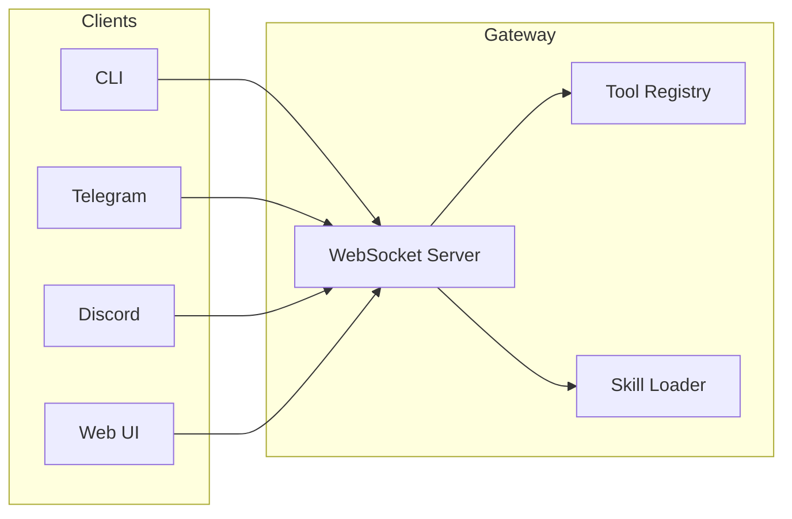

# Gateway API

Das K.I.T. Gateway ist der zentrale Server, der alle Komponenten verbindet. Es bietet eine WebSocket-basierte API für Echtzeit-Kommunikation.

## Übersicht



## Verbindung

### Endpoint

```
ws://127.0.0.1:18800
```

### Environment Variables

| Variable | Default | Beschreibung |
|----------|---------|--------------|
| `KIT_GATEWAY_PORT` | `18800` | WebSocket Port |
| `KIT_GATEWAY_HOST` | `127.0.0.1` | Bind-Adresse |
| `KIT_GATEWAY_TOKEN` | - | Auth-Token |

## Authentifizierung

### Connect Request

Jeder Client muss sich nach Verbindungsaufbau authentifizieren:

```json
{
  "type": "req",
  "id": "1",
  "method": "connect",
  "params": {
    "client": {
      "id": "my-client",
      "displayName": "My Trading Bot",
      "version": "1.0.0"
    },
    "auth": {
      "token": "your-gateway-token"
    }
  }
}
```

### Connect Response (hello-ok)

```json
{
  "type": "res",
  "id": "1",
  "ok": true,
  "payload": {
    "type": "hello-ok",
    "clientId": "kit-1707509123-abc123def",
    "version": "1.0.0",
    "skills": [
      {
        "id": "exchange-connector",
        "name": "Exchange Connector",
        "version": "1.0.0",
        "status": "loaded"
      }
    ],
    "tools": [
      {
        "name": "trade",
        "description": "Execute trades"
      }
    ]
  }
}
```

## API-Methoden

### health

Prüft den Systemzustand.

**Request:**
```json
{
  "type": "req",
  "id": "2",
  "method": "health"
}
```

**Response:**
```json
{
  "type": "res",
  "id": "2",
  "ok": true,
  "payload": {
    "ok": true,
    "uptime": 3600,
    "skills": {
      "exchange-connector": "healthy",
      "portfolio-tracker": "healthy"
    },
    "exchanges": {
      "binance": { "connected": true, "latency": 45 }
    }
  }
}
```

---

### status

Gibt den Gateway-Status zurück.

**Request:**
```json
{
  "type": "req",
  "id": "3",
  "method": "status"
}
```

**Response:**
```json
{
  "type": "res",
  "id": "3",
  "ok": true,
  "payload": {
    "gateway": "running",
    "clients": 2,
    "skills": 6,
    "tools": 4
  }
}
```

---

### skill.list

Listet alle geladenen Skills.

**Request:**
```json
{
  "type": "req",
  "id": "4",
  "method": "skill.list"
}
```

**Response:**
```json
{
  "type": "res",
  "id": "4",
  "ok": true,
  "payload": {
    "skills": [
      {
        "id": "exchange-connector",
        "name": "Exchange Connector",
        "description": "Börsen-API-Anbindung",
        "version": "1.0.0",
        "status": "loaded"
      },
      {
        "id": "portfolio-tracker",
        "name": "Portfolio Tracker",
        "description": "Portfolio-Überwachung",
        "version": "1.0.0",
        "status": "loaded"
      }
    ]
  }
}
```

---

### tool.invoke

Führt ein registriertes Tool aus.

**Request:**
```json
{
  "type": "req",
  "id": "5",
  "method": "tool.invoke",
  "params": {
    "tool": "trade",
    "args": {
      "action": "buy",
      "pair": "BTC/USDT",
      "amount": 100,
      "type": "market"
    }
  }
}
```

**Response:**
```json
{
  "type": "res",
  "id": "5",
  "ok": true,
  "payload": {
    "orderId": "12345",
    "status": "filled",
    "pair": "BTC/USDT",
    "side": "buy",
    "amount": 0.00149,
    "price": 67250,
    "fee": 0.1
  }
}
```

---

### trade.execute

Führt einen Trade aus.

**Request:**
```json
{
  "type": "req",
  "id": "6",
  "method": "trade.execute",
  "params": {
    "action": "buy",
    "pair": "ETH/USDT",
    "amount": 0.5,
    "type": "limit",
    "price": 3450,
    "stopLoss": 3200,
    "takeProfit": 4000
  }
}
```

**Response:**
```json
{
  "type": "res",
  "id": "6",
  "ok": true,
  "payload": {
    "orderId": "67890",
    "status": "pending",
    "pair": "ETH/USDT",
    "side": "buy",
    "type": "limit",
    "amount": 0.5,
    "price": 3450,
    "timestamp": "2026-02-09T21:24:00Z"
  }
}
```

**Trade Parameters:**

| Parameter | Type | Required | Beschreibung |
|-----------|------|----------|--------------|
| `action` | string | ✅ | `buy` oder `sell` |
| `pair` | string | ✅ | Trading-Paar (z.B. `BTC/USDT`) |
| `amount` | number | ✅ | Betrag |
| `type` | string | ✅ | `market`, `limit`, `stop-limit` |
| `price` | number | ❌ | Limit-Preis |
| `stopLoss` | number | ❌ | Stop-Loss Level |
| `takeProfit` | number | ❌ | Take-Profit Level |
| `exchange` | string | ❌ | Ziel-Exchange |

---

### market.data

Ruft Marktdaten ab.

**Request:**
```json
{
  "type": "req",
  "id": "7",
  "method": "market.data",
  "params": {
    "action": "ohlcv",
    "pair": "BTC/USDT",
    "timeframe": "1h",
    "limit": 100
  }
}
```

**Response:**
```json
{
  "type": "res",
  "id": "7",
  "ok": true,
  "payload": {
    "pair": "BTC/USDT",
    "timeframe": "1h",
    "candles": [
      {
        "timestamp": 1707509123000,
        "open": 67000,
        "high": 67500,
        "low": 66800,
        "close": 67200,
        "volume": 1250.5
      }
    ]
  }
}
```

**Actions:**

| Action | Beschreibung |
|--------|--------------|
| `price` | Aktueller Preis |
| `ohlcv` | Candlestick-Daten |
| `orderbook` | Orderbuch |
| `ticker` | 24h-Ticker |
| `trades` | Recent Trades |
| `analyze` | Technische Analyse |

---

### portfolio.snapshot

Ruft Portfolio-Daten ab.

**Request:**
```json
{
  "type": "req",
  "id": "8",
  "method": "portfolio.snapshot",
  "params": {
    "action": "snapshot"
  }
}
```

**Response:**
```json
{
  "type": "res",
  "id": "8",
  "ok": true,
  "payload": {
    "timestamp": "2026-02-09T21:24:00Z",
    "totalValueUsd": 45231.50,
    "totalValueBtc": 0.673,
    "change24h": 2.3,
    "change7d": 5.1,
    "assets": [
      {
        "symbol": "BTC",
        "free": 0.5,
        "locked": 0.1,
        "total": 0.6,
        "valueUsd": 40350,
        "allocation": 89.2,
        "exchange": "binance"
      }
    ],
    "positions": [
      {
        "id": "pos-1",
        "pair": "BTC/USDT",
        "side": "long",
        "amount": 0.01,
        "entryPrice": 66500,
        "currentPrice": 67250,
        "unrealizedPnl": 7.5,
        "unrealizedPnlPercent": 1.13
      }
    ]
  }
}
```

---

### backtest.run

Startet einen Backtest.

**Request:**
```json
{
  "type": "req",
  "id": "9",
  "method": "backtest.run",
  "params": {
    "strategy": "ma_cross",
    "pair": "BTC/USDT",
    "timeframe": "1h",
    "start": "2025-01-01",
    "end": "2025-12-31",
    "initialCapital": 10000
  }
}
```

**Response:**
```json
{
  "type": "res",
  "id": "9",
  "ok": true,
  "payload": {
    "strategy": "ma_cross",
    "pair": "BTC/USDT",
    "period": {
      "start": "2025-01-01",
      "end": "2025-12-31"
    },
    "metrics": {
      "totalReturn": 2850,
      "totalReturnPercent": 28.5,
      "maxDrawdown": -12.3,
      "sharpeRatio": 1.85,
      "winRate": 0.62,
      "totalTrades": 48
    }
  }
}
```

<Info>
Backtests streamen Fortschritts-Events über `backtest:progress`.
</Info>

## Registrierte Tools

Die Gateway registriert folgende Standard-Tools:

| Tool | Beschreibung | Skill |
|------|--------------|-------|
| `trade` | Trades ausführen | auto-trader |
| `market` | Marktdaten abrufen | market-analysis |
| `portfolio` | Portfolio-Infos | portfolio-tracker |
| `backtest` | Backtests starten | backtester |

## Fehlerbehandlung

Fehlerhafte Requests werden mit `ok: false` beantwortet:

```json
{
  "type": "res",
  "id": "10",
  "ok": false,
  "error": {
    "code": "INSUFFICIENT_FUNDS",
    "message": "Not enough USDT to execute order",
    "retryable": false
  }
}
```

### Error Codes

| Code | Beschreibung |
|------|--------------|
| `INVALID_REQUEST` | Ungültiger Request |
| `AUTH_FAILED` | Authentifizierung fehlgeschlagen |
| `NOT_FOUND` | Ressource nicht gefunden |
| `RATE_LIMITED` | Zu viele Anfragen |
| `EXCHANGE_ERROR` | Exchange-Fehler |
| `INSUFFICIENT_FUNDS` | Nicht genug Guthaben |
| `INVALID_ORDER` | Ungültige Order-Parameter |
| `RISK_LIMIT_EXCEEDED` | Risiko-Limit überschritten |
| `INTERNAL_ERROR` | Interner Fehler |

## Client Libraries

### TypeScript/JavaScript

```typescript
import { KitClient } from '@binaryfaster/kit';

const client = new KitClient({
  url: 'ws://127.0.0.1:18800',
  token: 'your-token'
});

await client.connect();

// Trade ausführen
const order = await client.trade({
  action: 'buy',
  pair: 'BTC/USDT',
  amount: 100,
  type: 'market'
});

// Portfolio abrufen
const portfolio = await client.portfolio();

// Events abonnieren
client.on('trade:executed', (trade) => {
  console.log('Trade executed:', trade);
});
```

### Python

```python
from kit import KitClient

client = KitClient(
    url='ws://127.0.0.1:18800',
    token='your-token'
)

await client.connect()

# Trade ausführen
order = await client.trade(
    action='buy',
    pair='BTC/USDT',
    amount=100,
    type='market'
)

# Portfolio abrufen
portfolio = await client.portfolio()
```

## Rate Limiting

Die Gateway limitiert Anfragen:

| Limit | Wert |
|-------|------|
| Requests/Sekunde | 10 |
| Requests/Minute | 300 |
| Concurrent Connections | 50 |

Bei Überschreitung:

```json
{
  "type": "res",
  "id": "11",
  "ok": false,
  "error": {
    "code": "RATE_LIMITED",
    "message": "Too many requests",
    "retryable": true,
    "retryAfterMs": 1000
  }
}
```

## Nächste Schritte

<Columns>
  <Card title="WebSocket Protocol" href="/api/websocket" icon="zap">
    Detailliertes Protokoll
  </Card>
  <Card title="Events" href="/api/events" icon="bell">
    Event-Typen
  </Card>
  <Card title="Skills" href="/skills" icon="puzzle">
    Skill-Referenz
  </Card>
</Columns>
