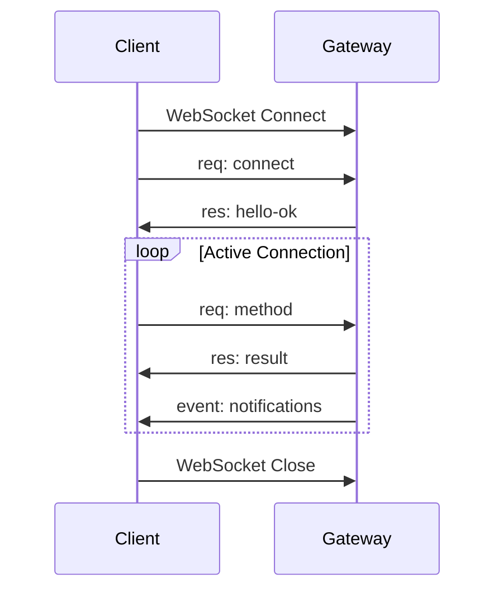

# WebSocket Protocol

Das K.I.T. Gateway kommuniziert über ein JSON-basiertes WebSocket-Protokoll. Diese Spezifikation beschreibt alle Message-Typen und deren Format.

## Protokoll-Version

```
Protocol Version: 1
Min Version: 1
Max Version: 1
```

## Message-Typen

Es gibt drei grundlegende Message-Typen:

| Type | Richtung | Beschreibung |
|------|----------|--------------|
| `req` | Client → Gateway | Request |
| `res` | Gateway → Client | Response |
| `event` | Gateway → Client | Event (Push) |

## Request Format

```typescript
interface Request {
  type: 'req';
  id: string;         // Unique request ID
  method: string;     // Method name
  params?: any;       // Method parameters
}
```

**Beispiel:**
```json
{
  "type": "req",
  "id": "req-001",
  "method": "trade.execute",
  "params": {
    "action": "buy",
    "pair": "BTC/USDT",
    "amount": 0.01
  }
}
```

### Request ID

- Muss eindeutig pro Verbindung sein
- Wird in der Response zurückgegeben
- Format: beliebiger String (empfohlen: UUID oder Counter)

## Response Format

```typescript
interface Response {
  type: 'res';
  id: string;         // Matching request ID
  ok: boolean;        // Success flag
  payload?: any;      // Result (if ok=true)
  error?: {           // Error details (if ok=false)
    code: string;
    message: string;
    details?: any;
    retryable?: boolean;
    retryAfterMs?: number;
  };
}
```

**Success Example:**
```json
{
  "type": "res",
  "id": "req-001",
  "ok": true,
  "payload": {
    "orderId": "12345",
    "status": "filled"
  }
}
```

**Error Example:**
```json
{
  "type": "res",
  "id": "req-001",
  "ok": false,
  "error": {
    "code": "INSUFFICIENT_FUNDS",
    "message": "Not enough USDT",
    "retryable": false
  }
}
```

## Event Format

```typescript
interface Event {
  type: 'event';
  event: string;      // Event name
  payload?: any;      // Event data
  seq?: number;       // Sequence number (optional)
  stateVersion?: number; // State version (optional)
}
```

**Beispiel:**
```json
{
  "type": "event",
  "event": "trade:executed",
  "payload": {
    "orderId": "12345",
    "pair": "BTC/USDT",
    "side": "buy",
    "amount": 0.01,
    "price": 67250
  }
}
```

## Verbindungsablauf



### 1. WebSocket-Verbindung

```javascript
const ws = new WebSocket('ws://127.0.0.1:18800');
```

### 2. Connect Handshake

**Client sendet:**
```json
{
  "type": "req",
  "id": "connect-1",
  "method": "connect",
  "params": {
    "minProtocol": 1,
    "maxProtocol": 1,
    "client": {
      "id": "my-bot",
      "displayName": "My Trading Bot",
      "version": "1.0.0",
      "platform": "node"
    },
    "auth": {
      "token": "secret-token"
    }
  }
}
```

**Gateway antwortet:**
```json
{
  "type": "res",
  "id": "connect-1",
  "ok": true,
  "payload": {
    "type": "hello-ok",
    "clientId": "kit-1707509123-abc123",
    "version": "1.0.0",
    "skills": [...],
    "tools": [...],
    "snapshot": {
      "health": {...},
      "exchanges": {...}
    }
  }
}
```

### 3. Request/Response

Nach erfolgreicher Verbindung kann der Client Requests senden:

```json
{
  "type": "req",
  "id": "req-002",
  "method": "portfolio.snapshot",
  "params": {}
}
```

### 4. Events empfangen

Events werden vom Gateway gepusht:

```json
{
  "type": "event",
  "event": "market:price",
  "payload": {
    "pair": "BTC/USDT",
    "price": 67300,
    "change": 0.07
  }
}
```

## Event-Typen

### Trading Events

| Event | Payload | Beschreibung |
|-------|---------|--------------|
| `trade:executed` | TradeResponse | Trade ausgeführt |
| `trade:cancelled` | { orderId, reason } | Trade storniert |
| `position:opened` | Position | Position eröffnet |
| `position:closed` | Position | Position geschlossen |

**trade:executed:**
```json
{
  "type": "event",
  "event": "trade:executed",
  "payload": {
    "orderId": "12345",
    "pair": "BTC/USDT",
    "side": "buy",
    "type": "market",
    "amount": 0.01,
    "filledAmount": 0.01,
    "price": 67250,
    "avgPrice": 67250,
    "fee": 0.067,
    "status": "filled",
    "timestamp": "2026-02-09T21:24:00Z"
  }
}
```

### Market Events

| Event | Payload | Beschreibung |
|-------|---------|--------------|
| `market:price` | { pair, price, change } | Preisupdate |
| `market:candle` | OHLCV | Neue Kerze |

**market:price:**
```json
{
  "type": "event",
  "event": "market:price",
  "payload": {
    "pair": "BTC/USDT",
    "price": 67300,
    "bid": 67295,
    "ask": 67305,
    "change": 0.15,
    "timestamp": 1707509123000
  }
}
```

### Alert Events

| Event | Payload | Beschreibung |
|-------|---------|--------------|
| `alert:triggered` | Alert | Alert ausgelöst |

**alert:triggered:**
```json
{
  "type": "event",
  "event": "alert:triggered",
  "payload": {
    "id": "alert-001",
    "type": "price",
    "asset": "BTC/USDT",
    "condition": "above",
    "value": 70000,
    "currentValue": 70050,
    "message": "BTC has crossed $70,000!"
  }
}
```

### Backtest Events

| Event | Payload | Beschreibung |
|-------|---------|--------------|
| `backtest:progress` | { percent, trades, currentDate } | Fortschritt |
| `backtest:complete` | BacktestResult | Fertig |

**backtest:progress:**
```json
{
  "type": "event",
  "event": "backtest:progress",
  "payload": {
    "percent": 45,
    "tradesExecuted": 23,
    "currentDate": "2025-06-15",
    "currentEquity": 11250
  }
}
```

### System Events

| Event | Payload | Beschreibung |
|-------|---------|--------------|
| `exchange:connected` | { exchange, latency } | Exchange verbunden |
| `exchange:disconnected` | { exchange, reason } | Exchange getrennt |
| `shutdown` | { reason } | Gateway fährt runter |

## Heartbeat

Um die Verbindung aufrechtzuerhalten, sollte der Client regelmäßig Heartbeats senden:

```json
{
  "type": "req",
  "id": "heartbeat",
  "method": "health"
}
```

**Empfohlenes Intervall:** 30 Sekunden

## Subscriptions

### Market-Streams abonnieren

```json
{
  "type": "req",
  "id": "sub-1",
  "method": "subscribe",
  "params": {
    "channel": "market:price",
    "pairs": ["BTC/USDT", "ETH/USDT"]
  }
}
```

### Subscription beenden

```json
{
  "type": "req",
  "id": "unsub-1",
  "method": "unsubscribe",
  "params": {
    "channel": "market:price",
    "pairs": ["BTC/USDT"]
  }
}
```

## Error Codes

| Code | HTTP-Äquivalent | Beschreibung |
|------|-----------------|--------------|
| `INVALID_REQUEST` | 400 | Ungültiges Request-Format |
| `AUTH_FAILED` | 401 | Authentifizierung fehlgeschlagen |
| `NOT_FOUND` | 404 | Methode/Ressource nicht gefunden |
| `RATE_LIMITED` | 429 | Rate-Limit erreicht |
| `EXCHANGE_ERROR` | 502 | Exchange-Kommunikationsfehler |
| `INSUFFICIENT_FUNDS` | 400 | Nicht genug Guthaben |
| `INVALID_ORDER` | 400 | Ungültige Order-Parameter |
| `RISK_LIMIT_EXCEEDED` | 400 | Risiko-Limit überschritten |
| `INTERNAL_ERROR` | 500 | Interner Server-Fehler |

## Timeouts

| Timeout | Wert | Beschreibung |
|---------|------|--------------|
| Connect | 10s | Verbindungsaufbau |
| Request | 30s | Standard-Request |
| Heartbeat | 30s | Heartbeat-Intervall |

## Reconnection

Bei Verbindungsabbruch:

1. **Exponential Backoff**: 1s, 2s, 4s, 8s, max 60s
2. **Nach Reconnect**: Erneutes `connect` erforderlich
3. **Subscriptions**: Müssen neu abonniert werden

```typescript
let reconnectDelay = 1000;

function reconnect() {
  setTimeout(() => {
    ws = new WebSocket('ws://127.0.0.1:18800');
    ws.onopen = () => {
      reconnectDelay = 1000; // Reset
      sendConnect();
    };
    ws.onclose = () => {
      reconnectDelay = Math.min(reconnectDelay * 2, 60000);
      reconnect();
    };
  }, reconnectDelay);
}
```

## TypeScript Typen

```typescript
// Message types
type MessageType = 'req' | 'res' | 'event';

interface Request {
  type: 'req';
  id: string;
  method: string;
  params?: any;
}

interface Response {
  type: 'res';
  id: string;
  ok: boolean;
  payload?: any;
  error?: {
    code: string;
    message: string;
    details?: any;
    retryable?: boolean;
    retryAfterMs?: number;
  };
}

interface Event {
  type: 'event';
  event: string;
  payload?: any;
  seq?: number;
  stateVersion?: number;
}

// Trading types
interface TradeRequest {
  action: 'buy' | 'sell';
  pair: string;
  amount: number;
  type: 'market' | 'limit' | 'stop-limit';
  price?: number;
  stopPrice?: number;
  exchange?: string;
  stopLoss?: number;
  takeProfit?: number;
}

interface TradeResponse {
  orderId: string;
  status: 'pending' | 'filled' | 'partial' | 'cancelled' | 'rejected';
  pair: string;
  side: 'buy' | 'sell';
  type: string;
  amount: number;
  filledAmount: number;
  price: number;
  avgPrice?: number;
  fee?: number;
  timestamp: string;
}

// Portfolio types
interface PortfolioSnapshot {
  timestamp: string;
  totalValueUsd: number;
  totalValueBtc: number;
  assets: AssetBalance[];
  positions: Position[];
  change24h: number;
  change7d: number;
}

interface Position {
  id: string;
  pair: string;
  side: 'long' | 'short';
  amount: number;
  entryPrice: number;
  currentPrice: number;
  unrealizedPnl: number;
  unrealizedPnlPercent: number;
  stopLoss?: number;
  takeProfit?: number;
  exchange: string;
  openedAt: string;
}
```

## Beispiel-Client

```typescript
import WebSocket from 'ws';

class KitClient {
  private ws: WebSocket;
  private requestId = 0;
  private pending = new Map<string, { resolve: Function; reject: Function }>();
  
  constructor(private url: string, private token?: string) {}
  
  async connect(): Promise<void> {
    return new Promise((resolve, reject) => {
      this.ws = new WebSocket(this.url);
      
      this.ws.onopen = async () => {
        try {
          await this.handshake();
          resolve();
        } catch (err) {
          reject(err);
        }
      };
      
      this.ws.onmessage = (msg) => this.handleMessage(msg.data);
      this.ws.onerror = (err) => reject(err);
    });
  }
  
  private async handshake(): Promise<void> {
    return this.request('connect', {
      client: { id: 'example', version: '1.0.0' },
      auth: { token: this.token }
    });
  }
  
  async request(method: string, params?: any): Promise<any> {
    const id = `req-${++this.requestId}`;
    
    return new Promise((resolve, reject) => {
      this.pending.set(id, { resolve, reject });
      this.ws.send(JSON.stringify({ type: 'req', id, method, params }));
      
      setTimeout(() => {
        if (this.pending.has(id)) {
          this.pending.delete(id);
          reject(new Error('Request timeout'));
        }
      }, 30000);
    });
  }
  
  private handleMessage(data: string): void {
    const msg = JSON.parse(data);
    
    if (msg.type === 'res') {
      const handler = this.pending.get(msg.id);
      if (handler) {
        this.pending.delete(msg.id);
        if (msg.ok) {
          handler.resolve(msg.payload);
        } else {
          handler.reject(new Error(msg.error.message));
        }
      }
    } else if (msg.type === 'event') {
      this.emit(msg.event, msg.payload);
    }
  }
}
```

## Nächste Schritte

<Columns>
  <Card title="Gateway API" href="/api/gateway" icon="server">
    API-Methoden Referenz
  </Card>
  <Card title="Skills" href="/skills" icon="puzzle">
    Skill-Dokumentation
  </Card>
  <Card title="Examples" href="/examples" icon="code">
    Code-Beispiele
  </Card>
</Columns>
