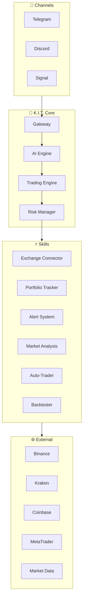
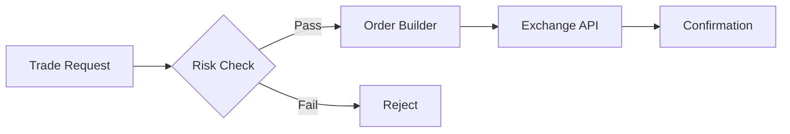
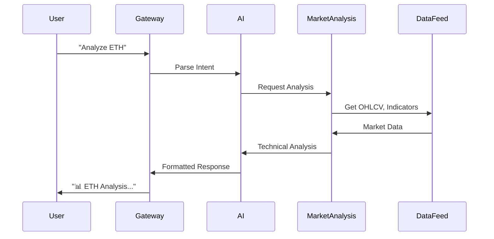

# Architecture

K.I.T. is built as a modular system that connects AI-powered trading decisions with exchange APIs and messaging channels.

## Overview



## Components

### Gateway

The gateway is the heart of K.I.T. It:

- Receives messages from all channels
- Routes them to the AI Engine
- Manages sessions per user
- Coordinates all skills

```
User Message → Gateway → AI Engine → Action → Response
```

### AI Engine

The AI engine interprets natural language and generates trading decisions:

```json
{
  "engine": {
    "provider": "anthropic",
    "model": "claude-sonnet-4-20250514",
    "context": {
      "portfolio": true,
      "marketData": true,
      "openPositions": true,
      "riskLimits": true
    }
  }
}
```

**Responsibilities:**
- Natural language processing
- Intent recognition (buy, sell, analyze, etc.)
- Market interpretation
- Strategy recommendations

### Trading Engine

Executes trading operations:



**Features:**
- Order management (limit, market, stop)
- Position tracking
- Order routing to exchanges
- Trade execution reports

### Risk Manager

Protects against excessive losses:

```json
{
  "riskManager": {
    "checks": [
      "maxPositionSize",
      "dailyLossLimit",
      "openPositionLimit",
      "leverageLimit"
    ],
    "actions": {
      "onLimitReached": "reject",
      "onDailyLoss": "halt_trading",
      "onDrawdown": "reduce_exposure"
    }
  }
}
```

## Data Flow

### Trade Execution


### Market Analysis



## Skill System

Skills are modular extensions:

```
skills/
├── exchange-connector/     # Exchange APIs
│   ├── binance.ts
│   ├── kraken.ts
│   └── metatrader.ts
├── portfolio-tracker/      # Portfolio Management
├── alert-system/          # Price Alerts
├── market-analysis/       # Technical Analysis
├── auto-trader/           # Automated Strategies
└── backtester/            # Strategy Testing
```

Each skill has:
- `SKILL.md` - Documentation
- `index.ts` - Main logic
- `config.json` - Configuration

## State Management

```json
{
  "state": {
    "portfolio": {
      "storage": "local",
      "sync": "realtime"
    },
    "positions": {
      "storage": "memory + exchange",
      "sync": "polling (5s)"
    },
    "alerts": {
      "storage": "local",
      "persistence": true
    },
    "sessions": {
      "storage": "memory",
      "ttl": "24h"
    }
  }
}
```

## Scalability

### Single Instance

```
┌─────────────────────────────────────┐
│           K.I.T. Instance           │
├─────────────────────────────────────┤
│  Gateway │ AI │ Trading │ Risk      │
├─────────────────────────────────────┤
│     Skills (Exchange, Portfolio)    │
└─────────────────────────────────────┘
         ↕           ↕           ↕
    Binance      Kraken      Telegram
```

### Multi-Instance (Advanced)

```
┌─────────────┐     ┌─────────────┐
│  K.I.T. #1  │     │  K.I.T. #2  │
│  (Crypto)   │     │   (Forex)   │
└──────┬──────┘     └──────┬──────┘
       │                   │
       └───────┬───────────┘
               │
         ┌─────┴─────┐
         │   Redis   │
         │  (State)  │
         └───────────┘
```

## Security Layers

```
1. Channel Auth      → Telegram Bot Token, Discord OAuth
2. Gateway Auth      → API Token for external access
3. Exchange Auth     → API Keys (encrypted)
4. Risk Auth         → Trade limits, IP whitelist
```

## Extensibility

### Add New Skill

```typescript
// skills/my-skill/index.ts
import { Skill } from '@kit/core';

export const mySkill: Skill = {
  name: 'my-skill',
  version: '1.0.0',
  commands: {
    'my-command': async (ctx) => {
      // Skill logic
    }
  }
};
```

### Add New Exchange

```typescript
// skills/exchange-connector/my-exchange.ts
import { Exchange } from '@kit/exchanges';

export class MyExchange extends Exchange {
  async buy(pair: string, amount: number) { ... }
  async sell(pair: string, amount: number) { ... }
  async getBalance() { ... }
}
```

## Next Steps

<Columns>
  <Card title="Skills" href="/concepts/skills" icon="plug">
    Skill system in detail.
  </Card>
  <Card title="Trading Tools" href="/concepts/trading-tools" icon="wrench">
    Available trading tools.
  </Card>
  <Card title="Risk Management" href="/concepts/risk-management" icon="shield">
    Understand risk control.
  </Card>
</Columns>
