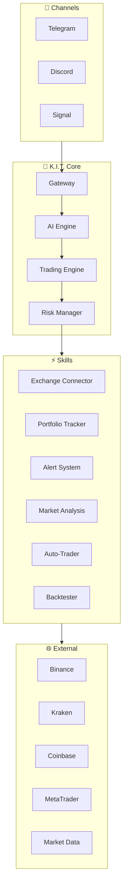
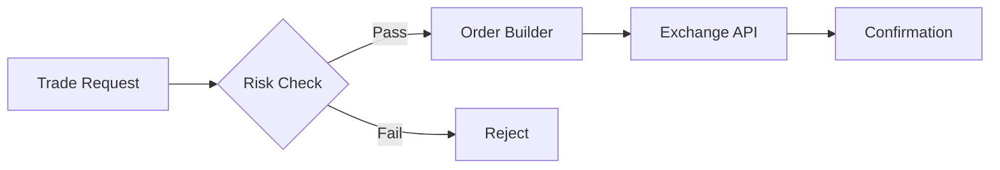
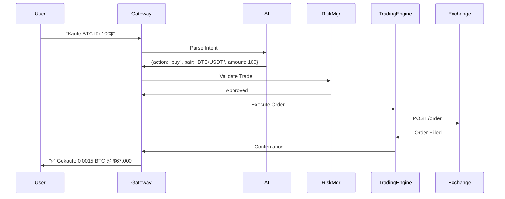
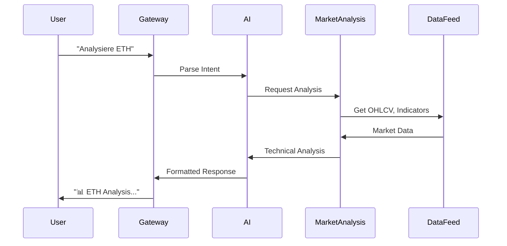

# Architektur

K.I.T. ist als modulares System aufgebaut, das KI-gesteuerte Trading-Entscheidungen mit Exchange-APIs und Messaging-Channels verbindet.

## Übersicht



## Komponenten

### Gateway

Der Gateway ist das Herzstück von K.I.T. Er:

- Empfängt Nachrichten von allen Channels
- Routet sie zur AI Engine
- Verwaltet Sessions pro User
- Koordiniert alle Skills

```
User Message → Gateway → AI Engine → Action → Response
```

### AI Engine

Die KI-Engine interpretiert natürliche Sprache und generiert Trading-Entscheidungen:

```json
{
  "engine": {
    "provider": "anthropic",
    "model": "claude-sonnet-4-20250514",
    "context": {
      "portfolio": true,
      "marketData": true,
      "openPositions": true,
      "riskLimits": true
    }
  }
}
```

**Verantwortlichkeiten:**
- Natürliche Sprachverarbeitung
- Intent-Erkennung (buy, sell, analyze, etc.)
- Marktinterpretation
- Strategie-Empfehlungen

### Trading Engine

Führt Trading-Operationen aus:



**Features:**
- Order Management (Limit, Market, Stop)
- Position Tracking
- Order-Routing zu Exchanges
- Trade-Execution-Reports

### Risk Manager

Schützt vor übermäßigen Verlusten:

```json
{
  "riskManager": {
    "checks": [
      "maxPositionSize",
      "dailyLossLimit",
      "openPositionLimit",
      "leverageLimit"
    ],
    "actions": {
      "onLimitReached": "reject",
      "onDailyLoss": "halt_trading",
      "onDrawdown": "reduce_exposure"
    }
  }
}
```

## Datenfluss

### Trade-Ausführung



### Market Analysis



## Skill-System

Skills sind modulare Erweiterungen:

```
skills/
├── exchange-connector/     # Exchange APIs
│   ├── binance.ts
│   ├── kraken.ts
│   └── metatrader.ts
├── portfolio-tracker/      # Portfolio Management
├── alert-system/          # Price Alerts
├── market-analysis/       # Technical Analysis
├── auto-trader/           # Automated Strategies
└── backtester/            # Strategy Testing
```

Jeder Skill hat:
- `SKILL.md` - Dokumentation
- `index.ts` - Hauptlogik
- `config.json` - Konfiguration

## State Management

```json
{
  "state": {
    "portfolio": {
      "storage": "local",
      "sync": "realtime"
    },
    "positions": {
      "storage": "memory + exchange",
      "sync": "polling (5s)"
    },
    "alerts": {
      "storage": "local",
      "persistence": true
    },
    "sessions": {
      "storage": "memory",
      "ttl": "24h"
    }
  }
}
```

## Skalierbarkeit

### Single Instance

```
┌─────────────────────────────────────┐
│           K.I.T. Instance           │
├─────────────────────────────────────┤
│  Gateway │ AI │ Trading │ Risk      │
├─────────────────────────────────────┤
│     Skills (Exchange, Portfolio)    │
└─────────────────────────────────────┘
         ↕           ↕           ↕
    Binance      Kraken      Telegram
```

### Multi-Instance (Advanced)

```
┌─────────────┐     ┌─────────────┐
│  K.I.T. #1  │     │  K.I.T. #2  │
│  (Crypto)   │     │   (Forex)   │
└──────┬──────┘     └──────┬──────┘
       │                   │
       └───────┬───────────┘
               │
         ┌─────┴─────┐
         │   Redis   │
         │  (State)  │
         └───────────┘
```

## Security Layers

```
1. Channel Auth      → Telegram Bot Token, Discord OAuth
2. Gateway Auth      → API Token für externe Zugriffe
3. Exchange Auth     → API Keys (verschlüsselt)
4. Risk Auth         → Trade-Limits, IP-Whitelist
```

## Erweiterbarkeit

### Neuen Skill hinzufügen

```typescript
// skills/my-skill/index.ts
import { Skill } from '@kit/core';

export const mySkill: Skill = {
  name: 'my-skill',
  version: '1.0.0',
  commands: {
    'my-command': async (ctx) => {
      // Skill-Logik
    }
  }
};
```

### Neue Exchange hinzufügen

```typescript
// skills/exchange-connector/my-exchange.ts
import { Exchange } from '@kit/exchanges';

export class MyExchange extends Exchange {
  async buy(pair: string, amount: number) { ... }
  async sell(pair: string, amount: number) { ... }
  async getBalance() { ... }
}
```

## Nächste Schritte

<Columns>
  <Card title="Skills" href="/concepts/skills" icon="plug">
    Skill-System im Detail.
  </Card>
  <Card title="Trading-Tools" href="/concepts/trading-tools" icon="wrench">
    Verfügbare Trading-Werkzeuge.
  </Card>
  <Card title="Risk Management" href="/concepts/risk-management" icon="shield">
    Risiko-Kontrolle verstehen.
  </Card>
</Columns>
