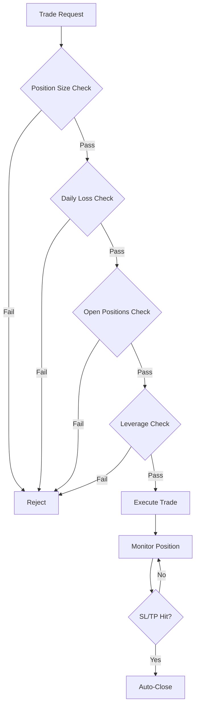

# Risk Management

Effective risk management is the key to long-term trading success. K.I.T. offers comprehensive tools to protect your capital.

<Warning>
**Rule #1:** Protect your capital. Profits come naturally when you don't lose too much.
</Warning>

## Overview



## Configuration

```json
{
  "risk": {
    "maxPositionSize": 0.1,      // Max 10% per position
    "maxDailyLoss": 0.05,        // Max 5% daily loss
    "maxWeeklyLoss": 0.15,       // Max 15% weekly loss
    "maxMonthlyLoss": 0.25,      // Max 25% monthly loss
    "maxOpenPositions": 5,       // Max open positions
    "maxLeverage": 3,            // Max leverage
    "stopLossRequired": true,    // SL required
    "stopLossDefault": 0.02,     // 2% default SL
    "takeProfitDefault": 0.06,   // 6% default TP
    "trailingStop": {
      "enabled": true,
      "activation": 0.02,
      "distance": 0.01
    }
  }
}
```

## Position Sizing

### Fixed Percent Method

Always risk the same percentage per trade:

```json
{
  "risk": {
    "method": "fixed-percent",
    "riskPerTrade": 0.01  // 1% per trade
  }
}
```

**Calculation:**
```
Position Size = (Portfolio * Risk%) / Stop-Loss%

Example:
Portfolio: $10,000
Risk: 1% ($100)
Stop-Loss: 2%

Position Size = $100 / 0.02 = $5,000
```

### Kelly Criterion

Optimal position size based on win rate:

```json
{
  "risk": {
    "method": "kelly",
    "kellyFraction": 0.25  // Quarter Kelly (conservative)
  }
}
```

### ATR-Based

Position size based on volatility:

```json
{
  "risk": {
    "method": "atr",
    "atrMultiplier": 2,
    "maxRiskPerTrade": 0.02
  }
}
```

## Stop-Loss Strategies

### Fixed Percent SL

```bash
kit buy BTC/USDT 100 --stop-loss 2%
```

### ATR-Based SL

```bash
kit buy BTC/USDT 100 --stop-loss atr:2
```

Stop-Loss = Entry - (2 * ATR)

### Support-Based SL

```bash
kit buy BTC/USDT 100 --stop-loss support
```

Stop-loss below nearest support.

### Trailing Stop

```bash
kit buy BTC/USDT 100 --trailing-stop 2%
```

```json
{
  "trailingStop": {
    "enabled": true,
    "activation": 0.02,    // Activates at 2% profit
    "distance": 0.01,      // 1% distance from high
    "step": 0.005          // 0.5% steps
  }
}
```

## Take-Profit Strategies

### Fixed TP

```bash
kit buy BTC/USDT 100 --take-profit 6%
```

### Partial Take-Profit

Realize profits in stages:

```bash
kit buy BTC/USDT 100 --partial-tp "3%:33%, 6%:33%, 10%:34%"
```

- Sell 33% at +3%
- Sell 33% at +6%
- Sell 34% at +10%

### Risk/Reward Ratio

```bash
kit buy BTC/USDT 100 --stop-loss 2% --rr 3
```

Take-Profit = 3 * Stop-Loss = 6%

## Loss Limits

### Daily Limit

```json
{
  "risk": {
    "maxDailyLoss": 0.05,
    "onDailyLossReached": "halt"  // "halt", "warn", "reduce"
  }
}
```

**Actions:**
- `halt`: Stop trading for today
- `warn`: Send warning, continue trading
- `reduce`: Halve position sizes

### Drawdown Protection

```json
{
  "risk": {
    "maxDrawdown": 0.20,           // 20% max drawdown
    "onDrawdownReached": "halt",
    "drawdownRecovery": "gradual"  // Gradual resumption
  }
}
```

## Portfolio Risk

### Correlation Limit

```json
{
  "risk": {
    "maxCorrelatedExposure": 0.5  // Max 50% in correlated assets
  }
}
```

### Sector Limits

```json
{
  "risk": {
    "sectorLimits": {
      "defi": 0.3,      // Max 30% in DeFi
      "layer1": 0.4,    // Max 40% in L1s
      "memecoins": 0.05 // Max 5% in memecoins
    }
  }
}
```

## Risk Dashboard

```bash
kit risk status
```

Output:
```
🛡️ Risk Dashboard
─────────────────────────
Portfolio: $10,000

Today's Losses: $150 (1.5%)
├─ Limit: $500 (5%)
└─ Status: ✅ OK

Open Positions: 3/5
├─ BTC Long: $2,000 (20%)
├─ ETH Long: $1,500 (15%)
└─ SOL Short: $500 (5%)

Total Exposure: 40%
Max Drawdown (7d): -3.2%

⚠️ Warnings:
• BTC position approaching TP (currently +5.2%)
• SOL SL should be trailed
```

## Risk Commands

```bash
# Risk status
kit risk status

# Calculate position size
kit risk calc --entry 67000 --stop 65000 --risk 1%

# Check all SLs
kit risk check-stops

# Reduce exposure
kit risk reduce 50%

# Pause trading
kit risk halt --duration 24h

# Resume trading
kit risk resume
```

## Best Practices

<Tip>
**Golden Rules:**

1. **1-2% Rule:** Never risk more than 1-2% per trade
2. **Risk/Reward:** At least 1:2, ideally 1:3
3. **Diversification:** Don't put all eggs in one basket
4. **Emotions:** Let K.I.T. enforce the rules
5. **Review:** Weekly risk analysis
</Tip>

## Risk Scenarios

### Scenario 1: Black Swan Event

```json
{
  "risk": {
    "emergencyStop": {
      "enabled": true,
      "portfolioDropTrigger": 0.10,  // 10% drop
      "action": "close-all"
    }
  }
}
```

### Scenario 2: Exchange Outage

```json
{
  "risk": {
    "exchangeFailover": {
      "enabled": true,
      "backup": "kraken",
      "hedgeOnOutage": true
    }
  }
}
```

## Automatic Adjustments

K.I.T. can automatically adjust risk parameters:

```json
{
  "risk": {
    "adaptive": {
      "enabled": true,
      "reduceOnLossStreak": 3,      // After 3 losses
      "reductionFactor": 0.5,       // Halve
      "increaseOnWinStreak": 5,     // After 5 wins
      "increaseFactor": 1.25,       // 25% increase
      "maxIncrease": 2              // Max 2x normal
    }
  }
}
```

## Next Steps

<Columns>
  <Card title="First Trade" href="/start/first-trade" icon="trending-up">
    Risk management in practice.
  </Card>
  <Card title="Auto-Trader" href="/skills/auto-trader" icon="bot">
    Automatic strategies with risk control.
  </Card>
  <Card title="Backtesting" href="/skills/backtester" icon="history">
    Test risk parameters.
  </Card>
</Columns>
