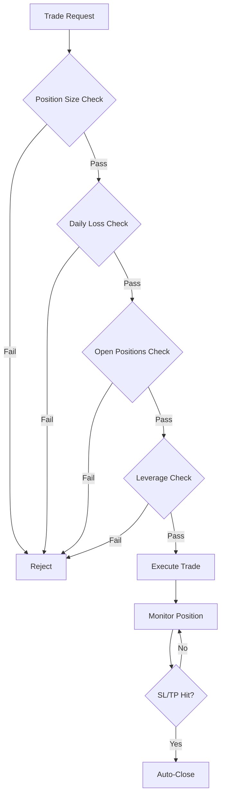

# Risk Management

Effektives Risiko-Management ist der Schlüssel zum langfristigen Trading-Erfolg. K.I.T. bietet umfangreiche Tools, um dein Kapital zu schützen.

<Warning>
**Regel Nr. 1:** Schütze dein Kapital. Gewinne kommen von selbst, wenn du nicht zu viel verlierst.
</Warning>

## Übersicht



## Konfiguration

```json
{
  "risk": {
    "maxPositionSize": 0.1,      // Max 10% pro Position
    "maxDailyLoss": 0.05,        // Max 5% Tagesverlust
    "maxWeeklyLoss": 0.15,       // Max 15% Wochenverlust
    "maxMonthlyLoss": 0.25,      // Max 25% Monatsverlust
    "maxOpenPositions": 5,       // Max offene Positionen
    "maxLeverage": 3,            // Max Hebel
    "stopLossRequired": true,    // SL Pflicht
    "stopLossDefault": 0.02,     // 2% Standard-SL
    "takeProfitDefault": 0.06,   // 6% Standard-TP
    "trailingStop": {
      "enabled": true,
      "activation": 0.02,
      "distance": 0.01
    }
  }
}
```

## Position Sizing

### Feste Prozent-Methode

Riskiere immer den gleichen Prozentsatz pro Trade:

```json
{
  "risk": {
    "method": "fixed-percent",
    "riskPerTrade": 0.01  // 1% pro Trade
  }
}
```

**Berechnung:**
```
Position Size = (Portfolio * Risk%) / Stop-Loss%

Beispiel:
Portfolio: $10,000
Risk: 1% ($100)
Stop-Loss: 2%

Position Size = $100 / 0.02 = $5,000
```

### Kelly-Kriterium

Optimale Positionsgröße basierend auf Win-Rate:

```json
{
  "risk": {
    "method": "kelly",
    "kellyFraction": 0.25  // Viertel-Kelly (konservativ)
  }
}
```

### ATR-basiert

Position Size basierend auf Volatilität:

```json
{
  "risk": {
    "method": "atr",
    "atrMultiplier": 2,
    "maxRiskPerTrade": 0.02
  }
}
```

## Stop-Loss Strategien

### Fester Prozent-SL

```bash
kit buy BTC/USDT 100 --stop-loss 2%
```

### ATR-basierter SL

```bash
kit buy BTC/USDT 100 --stop-loss atr:2
```

Stop-Loss = Entry - (2 * ATR)

### Support-basierter SL

```bash
kit buy BTC/USDT 100 --stop-loss support
```

Stop-Loss unterhalb des nächsten Supports.

### Trailing Stop

```bash
kit buy BTC/USDT 100 --trailing-stop 2%
```

```json
{
  "trailingStop": {
    "enabled": true,
    "activation": 0.02,    // Aktiviert bei 2% Gewinn
    "distance": 0.01,      // 1% Abstand zum Höchststand
    "step": 0.005          // 0.5% Schritte
  }
}
```

## Take-Profit Strategien

### Festes TP

```bash
kit buy BTC/USDT 100 --take-profit 6%
```

### Partial Take-Profit

Gewinne in Stufen realisieren:

```bash
kit buy BTC/USDT 100 --partial-tp "3%:33%, 6%:33%, 10%:34%"
```

- 33% verkaufen bei +3%
- 33% verkaufen bei +6%
- 34% verkaufen bei +10%

### Risk/Reward Ratio

```bash
kit buy BTC/USDT 100 --stop-loss 2% --rr 3
```

Take-Profit = 3 * Stop-Loss = 6%

## Verlust-Limits

### Tägliches Limit

```json
{
  "risk": {
    "maxDailyLoss": 0.05,
    "onDailyLossReached": "halt"  // "halt", "warn", "reduce"
  }
}
```

**Aktionen:**
- `halt`: Trading für heute stoppen
- `warn`: Warnung senden, weiter traden
- `reduce`: Positionsgrößen halbieren

### Drawdown-Schutz

```json
{
  "risk": {
    "maxDrawdown": 0.20,           // 20% max Drawdown
    "onDrawdownReached": "halt",
    "drawdownRecovery": "gradual"  // Langsame Wiederaufnahme
  }
}
```

## Portfolio-Risiko

### Korrelationsgrenze

```json
{
  "risk": {
    "maxCorrelatedExposure": 0.5  // Max 50% in korrelierte Assets
  }
}
```

### Sektor-Limits

```json
{
  "risk": {
    "sectorLimits": {
      "defi": 0.3,      // Max 30% in DeFi
      "layer1": 0.4,    // Max 40% in L1s
      "memecoins": 0.05 // Max 5% in Memecoins
    }
  }
}
```

## Risiko-Dashboard

```bash
kit risk status
```

Output:
```
🛡️ Risiko-Dashboard
─────────────────────────
Portfolio: $10,000

Heutige Verluste: $150 (1.5%)
├─ Limit: $500 (5%)
└─ Status: ✅ OK

Offene Positionen: 3/5
├─ BTC Long: $2,000 (20%)
├─ ETH Long: $1,500 (15%)
└─ SOL Short: $500 (5%)

Gesamt-Exposure: 40%
Max Drawdown (7d): -3.2%

⚠️ Warnungen:
• BTC Position nähert sich TP (aktuell +5.2%)
• SOL SL sollte nachgezogen werden
```

## Risiko-Befehle

```bash
# Risiko-Status
kit risk status

# Position-Size berechnen
kit risk calc --entry 67000 --stop 65000 --risk 1%

# Alle SL prüfen
kit risk check-stops

# Exposure reduzieren
kit risk reduce 50%

# Trading pausieren
kit risk halt --duration 24h

# Trading wieder aufnehmen
kit risk resume
```

## Best Practices

<Tip>
**Goldene Regeln:**

1. **1-2% Regel:** Riskiere nie mehr als 1-2% pro Trade
2. **Risk/Reward:** Mindestens 1:2, idealerweise 1:3
3. **Diversifikation:** Nicht alles auf eine Karte
4. **Emotionen:** Lass K.I.T. die Regeln durchsetzen
5. **Review:** Wöchentliche Risiko-Analyse
</Tip>

## Risiko-Szenarien

### Szenario 1: Black Swan Event

```json
{
  "risk": {
    "emergencyStop": {
      "enabled": true,
      "portfolioDropTrigger": 0.10,  // 10% Drop
      "action": "close-all"
    }
  }
}
```

### Szenario 2: Exchange-Ausfall

```json
{
  "risk": {
    "exchangeFailover": {
      "enabled": true,
      "backup": "kraken",
      "hedgeOnOutage": true
    }
  }
}
```

## Automatische Anpassungen

K.I.T. kann Risiko-Parameter automatisch anpassen:

```json
{
  "risk": {
    "adaptive": {
      "enabled": true,
      "reduceOnLossStreak": 3,      // Nach 3 Verlusten
      "reductionFactor": 0.5,       // Halbieren
      "increaseOnWinStreak": 5,     // Nach 5 Gewinnen
      "increaseFactor": 1.25,       // 25% erhöhen
      "maxIncrease": 2              // Max 2x normal
    }
  }
}
```

## Nächste Schritte

<Columns>
  <Card title="Erster Trade" href="/start/first-trade" icon="trending-up">
    Risiko-Management in der Praxis.
  </Card>
  <Card title="Auto-Trader" href="/skills/auto-trader" icon="bot">
    Automatische Strategien mit Risiko-Kontrolle.
  </Card>
  <Card title="Backtesting" href="/skills/backtester" icon="history">
    Risiko-Parameter testen.
  </Card>
</Columns>
