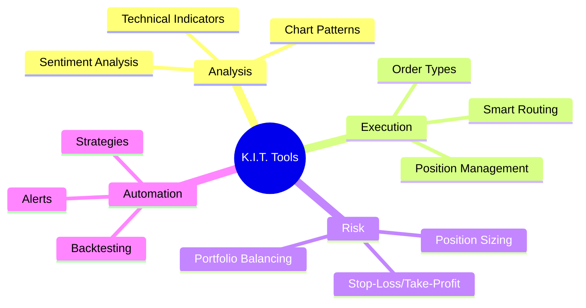

# Trading Tools

K.I.T. offers a variety of tools for professional trading. Here's an overview of all available tools.

## Overview



## Order Types

### Market Order

Immediate execution at best available price.

```bash
kit buy BTC/USDT 100 --type market
```

```
"Buy BTC for $100 immediately"
```

### Limit Order

Execution only at specified price.

```bash
kit buy BTC/USDT 100 --price 65000
```

```
"Buy BTC for $100 at 65000"
```

### Stop-Limit Order

Limit order that activates at stop price.

```bash
kit buy BTC/USDT 100 --stop 66000 --limit 66100
```

```
"Buy BTC at stop 66k, limit 66.1k"
```

### Trailing Stop

Stop-loss that follows the price.

```bash
kit sell BTC/USDT --trailing-stop 2%
```

```
"Set 2% trailing stop for BTC"
```

### OCO (One-Cancels-Other)

Two orders where execution of one cancels the other.

```bash
kit oco BTC/USDT --take-profit 70000 --stop-loss 64000
```

```
"OCO: TP 70k, SL 64k for BTC"
```

## Technical Indicators

K.I.T. automatically calculates these indicators:

| Category | Indicators |
|----------|------------|
| **Trend** | SMA, EMA, MACD, ADX, Parabolic SAR |
| **Momentum** | RSI, Stochastic, CCI, Williams %R |
| **Volatility** | Bollinger Bands, ATR, Keltner Channels |
| **Volume** | OBV, Volume Profile, VWAP |
| **Support/Resistance** | Pivot Points, Fibonacci, Price Levels |

### Query Indicators

```bash
kit indicators BTC/USDT
```

```
"Show indicators for BTC"
```

Output:
```
📊 BTC/USDT Indicators
─────────────────────────
Trend:
• SMA(20): $66,500 (Price above ✅)
• SMA(50): $64,200 (Price above ✅)
• MACD: Bullish (0.42)
• ADX: 28 (Trend strengthening)

Momentum:
• RSI(14): 58 (Neutral)
• Stochastic: 65/72 (Neutral)

Volatility:
• BB: $64,500 - $68,500 (Price in middle)
• ATR: $1,200 (2.1%)

Support/Resistance:
• Support: $65,000, $63,500
• Resistance: $68,000, $70,000
```

## Chart Analysis

### Candlestick Patterns

K.I.T. automatically detects:

- **Bullish:** Hammer, Engulfing, Morning Star, Three White Soldiers
- **Bearish:** Shooting Star, Engulfing, Evening Star, Three Black Crows
- **Neutral:** Doji, Spinning Top, Harami

```bash
kit patterns BTC/USDT
```

```
"Show chart patterns for BTC"
```

### Chart Formations

- Head and Shoulders
- Double Top/Bottom
- Triangles (Ascending, Descending, Symmetrical)
- Wedges
- Flags and Pennants

## Position Management

### Open Position

```bash
# With automatic risk management
kit position open BTC/USDT long 100 \
  --stop-loss 2% \
  --take-profit 6% \
  --risk 1%
```

### Modify Position

```bash
# Trail stop-loss
kit position modify BTC/USDT --stop-loss 66500

# Adjust take-profit
kit position modify BTC/USDT --take-profit 72000

# Add to position
kit position add BTC/USDT 50
```

### Close Position

```bash
# Close completely
kit position close BTC/USDT

# Partial close
kit position close BTC/USDT 50%

# Close all positions
kit position close-all
```

## Portfolio Tools

### Rebalancing

```bash
# Rebalance portfolio
kit portfolio rebalance --target "BTC:50%, ETH:30%, USDT:20%"
```

```
"Rebalance: 50% BTC, 30% ETH, 20% USDT"
```

### Correlation Analysis

```bash
kit portfolio correlation
```

Output:
```
📊 Portfolio Correlation
─────────────────────────
        BTC    ETH    SOL
BTC    1.00   0.85   0.72
ETH    0.85   1.00   0.78
SOL    0.72   0.78   1.00

⚠️ High correlation: Diversification limited
```

### Performance Tracking

```bash
kit portfolio performance --period 30d
```

Output:
```
📈 Portfolio Performance (30 days)
─────────────────────────
Total: +12.5% ($1,250)
vs BTC: +3.2%
vs ETH: +8.1%

Best position: SOL +25%
Worst: LINK -5%

Sharpe Ratio: 1.8
Max Drawdown: -8.2%
Win Rate: 65%
```

## Screening Tools

### Market Scanner

```bash
kit scan --rsi-oversold --volume-spike
```

```
"Scan for oversold coins with volume spike"
```

Output:
```
🔍 Scan Results
─────────────────────────
LINK/USDT: RSI 25, Vol +280%
AVAX/USDT: RSI 28, Vol +150%
DOT/USDT: RSI 30, Vol +120%
```

### Watchlist

```bash
# Manage watchlist
kit watchlist add BTC ETH SOL
kit watchlist remove DOGE
kit watchlist show
```

## News & Sentiment

```bash
kit news BTC
kit sentiment BTC
```

Output:
```
📰 BTC News & Sentiment
─────────────────────────
Sentiment Score: 72/100 (Bullish)

Top News:
• "ETF inflows continue..." (Bullish)
• "Mining difficulty up..." (Neutral)
• "Major bank adoption..." (Bullish)

Social Metrics:
• Twitter Mentions: +45%
• Reddit Activity: +30%
• Fear & Greed: 65 (Greed)
```

## Alerts & Notifications

### Alert Types

```bash
# Price alert
kit alert BTC/USDT price 70000

# RSI alert
kit alert BTC/USDT rsi below 30

# Volume alert
kit alert BTC/USDT volume above 200%

# Pattern alert
kit alert BTC/USDT pattern "bullish engulfing"
```

### Alert Management

```bash
kit alerts list
kit alerts remove <id>
kit alerts pause
kit alerts resume
```

## Backtesting

```bash
kit backtest --strategy trend-following \
  --pair BTC/USDT \
  --from 2023-01-01 \
  --to 2024-01-01
```

Output:
```
📊 Backtest Results
─────────────────────────
Strategy: Trend Following
Period: 2023-01-01 to 2024-01-01

Performance:
• Total Return: +85%
• Max Drawdown: -15%
• Sharpe Ratio: 2.1
• Win Rate: 58%

Trades: 47
• Winners: 27 (Avg +8.2%)
• Losers: 20 (Avg -4.5%)
```

## Next Steps

<Columns>
  <Card title="Auto-Trader" href="/skills/auto-trader" icon="bot">
    Automatic trading strategies.
  </Card>
  <Card title="Backtester" href="/skills/backtester" icon="history">
    Test strategies.
  </Card>
  <Card title="Risk Management" href="/concepts/risk-management" icon="shield">
    Risk control.
  </Card>
</Columns>
