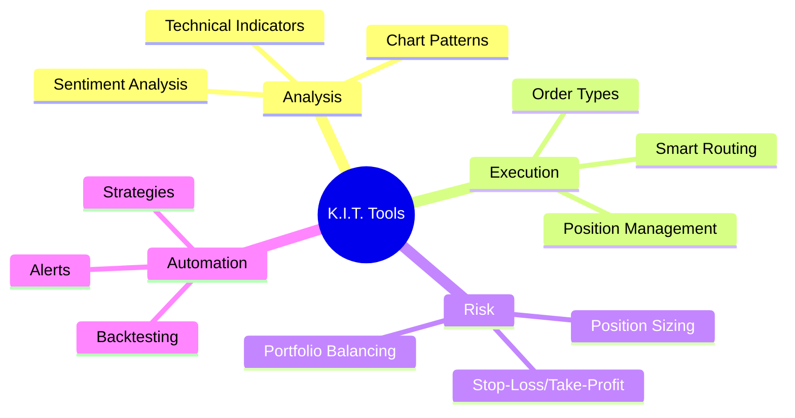

# Trading-Tools

K.I.T. bietet eine Vielzahl von Tools für professionelles Trading. Hier eine Übersicht aller verfügbaren Werkzeuge.

## Übersicht



## Order-Typen

### Market Order

Sofortige Ausführung zum besten verfügbaren Preis.

```bash
kit buy BTC/USDT 100 --type market
```

```
"Kaufe BTC für 100$ sofort"
```

### Limit Order

Ausführung nur bei erreichtem Preis.

```bash
kit buy BTC/USDT 100 --price 65000
```

```
"Kaufe BTC für 100$ bei 65000"
```

### Stop-Limit Order

Limit Order, die bei Stop-Preis aktiviert wird.

```bash
kit buy BTC/USDT 100 --stop 66000 --limit 66100
```

```
"Kaufe BTC bei Stop 66k, Limit 66.1k"
```

### Trailing Stop

Stop-Loss, der dem Preis folgt.

```bash
kit sell BTC/USDT --trailing-stop 2%
```

```
"Setze 2% Trailing Stop für BTC"
```

### OCO (One-Cancels-Other)

Zwei Orders, wobei die Ausführung der einen die andere storniert.

```bash
kit oco BTC/USDT --take-profit 70000 --stop-loss 64000
```

```
"OCO: TP 70k, SL 64k für BTC"
```

## Technische Indikatoren

K.I.T. berechnet automatisch diese Indikatoren:

| Kategorie | Indikatoren |
|-----------|-------------|
| **Trend** | SMA, EMA, MACD, ADX, Parabolic SAR |
| **Momentum** | RSI, Stochastic, CCI, Williams %R |
| **Volatilität** | Bollinger Bands, ATR, Keltner Channels |
| **Volumen** | OBV, Volume Profile, VWAP |
| **Support/Resistance** | Pivot Points, Fibonacci, Price Levels |

### Indikatoren abfragen

```bash
kit indicators BTC/USDT
```

```
"Zeig Indikatoren für BTC"
```

Output:
```
📊 BTC/USDT Indikatoren
─────────────────────────
Trend:
• SMA(20): $66,500 (Preis drüber ✅)
• SMA(50): $64,200 (Preis drüber ✅)
• MACD: Bullish (0.42)
• ADX: 28 (Trend stärker werdend)

Momentum:
• RSI(14): 58 (Neutral)
• Stochastic: 65/72 (Neutral)

Volatilität:
• BB: $64,500 - $68,500 (Preis mittig)
• ATR: $1,200 (2.1%)

Support/Resistance:
• Support: $65,000, $63,500
• Resistance: $68,000, $70,000
```

## Chart-Analyse

### Candlestick-Patterns

K.I.T. erkennt automatisch:

- **Bullish:** Hammer, Engulfing, Morning Star, Three White Soldiers
- **Bearish:** Shooting Star, Engulfing, Evening Star, Three Black Crows
- **Neutral:** Doji, Spinning Top, Harami

```bash
kit patterns BTC/USDT
```

```
"Zeig Chart-Patterns für BTC"
```

### Chart-Formationen

- Head and Shoulders
- Double Top/Bottom
- Triangles (Ascending, Descending, Symmetrical)
- Wedges
- Flags and Pennants

## Position-Management

### Position öffnen

```bash
# Mit automatischem Risk-Management
kit position open BTC/USDT long 100 \
  --stop-loss 2% \
  --take-profit 6% \
  --risk 1%
```

### Position modifizieren

```bash
# Stop-Loss nachziehen
kit position modify BTC/USDT --stop-loss 66500

# Take-Profit anpassen
kit position modify BTC/USDT --take-profit 72000

# Position vergrößern
kit position add BTC/USDT 50
```

### Position schließen

```bash
# Komplett schließen
kit position close BTC/USDT

# Teilweise schließen
kit position close BTC/USDT 50%

# Alle Positionen
kit position close-all
```

## Portfolio-Tools

### Rebalancing

```bash
# Portfolio rebalancen
kit portfolio rebalance --target "BTC:50%, ETH:30%, USDT:20%"
```

```
"Rebalance: 50% BTC, 30% ETH, 20% USDT"
```

### Korrelationsanalyse

```bash
kit portfolio correlation
```

Output:
```
📊 Portfolio-Korrelation
─────────────────────────
        BTC    ETH    SOL
BTC    1.00   0.85   0.72
ETH    0.85   1.00   0.78
SOL    0.72   0.78   1.00

⚠️ Hohe Korrelation: Diversifikation begrenzt
```

### Performance-Tracking

```bash
kit portfolio performance --period 30d
```

Output:
```
📈 Portfolio Performance (30 Tage)
─────────────────────────
Gesamt: +12.5% ($1,250)
vs BTC: +3.2%
vs ETH: +8.1%

Beste Position: SOL +25%
Schlechteste: LINK -5%

Sharpe Ratio: 1.8
Max Drawdown: -8.2%
Win Rate: 65%
```

## Screening-Tools

### Market Scanner

```bash
kit scan --rsi-oversold --volume-spike
```

```
"Scanne nach überverkauften Coins mit Volumen-Spike"
```

Output:
```
🔍 Scan-Ergebnisse
─────────────────────────
LINK/USDT: RSI 25, Vol +280%
AVAX/USDT: RSI 28, Vol +150%
DOT/USDT: RSI 30, Vol +120%
```

### Watchlist

```bash
# Watchlist verwalten
kit watchlist add BTC ETH SOL
kit watchlist remove DOGE
kit watchlist show
```

## News & Sentiment

```bash
kit news BTC
kit sentiment BTC
```

Output:
```
📰 BTC News & Sentiment
─────────────────────────
Sentiment Score: 72/100 (Bullish)

Top News:
• "ETF inflows continue..." (Bullish)
• "Mining difficulty up..." (Neutral)
• "Major bank adoption..." (Bullish)

Social Metrics:
• Twitter Mentions: +45%
• Reddit Activity: +30%
• Fear & Greed: 65 (Greed)
```

## Alerts & Benachrichtigungen

### Alert-Typen

```bash
# Preis-Alert
kit alert BTC/USDT price 70000

# RSI-Alert
kit alert BTC/USDT rsi below 30

# Volumen-Alert
kit alert BTC/USDT volume above 200%

# Pattern-Alert
kit alert BTC/USDT pattern "bullish engulfing"
```

### Alert-Verwaltung

```bash
kit alerts list
kit alerts remove <id>
kit alerts pause
kit alerts resume
```

## Backtesting

```bash
kit backtest --strategy trend-following \
  --pair BTC/USDT \
  --from 2023-01-01 \
  --to 2024-01-01
```

Output:
```
📊 Backtest Ergebnisse
─────────────────────────
Strategie: Trend Following
Zeitraum: 2023-01-01 bis 2024-01-01

Performance:
• Total Return: +85%
• Max Drawdown: -15%
• Sharpe Ratio: 2.1
• Win Rate: 58%

Trades: 47
• Gewinner: 27 (Avg +8.2%)
• Verlierer: 20 (Avg -4.5%)
```

## Nächste Schritte

<Columns>
  <Card title="Auto-Trader" href="/skills/auto-trader" icon="bot">
    Automatische Trading-Strategien.
  </Card>
  <Card title="Backtester" href="/skills/backtester" icon="history">
    Strategien testen.
  </Card>
  <Card title="Risk Management" href="/concepts/risk-management" icon="shield">
    Risiko-Kontrolle.
  </Card>
</Columns>
