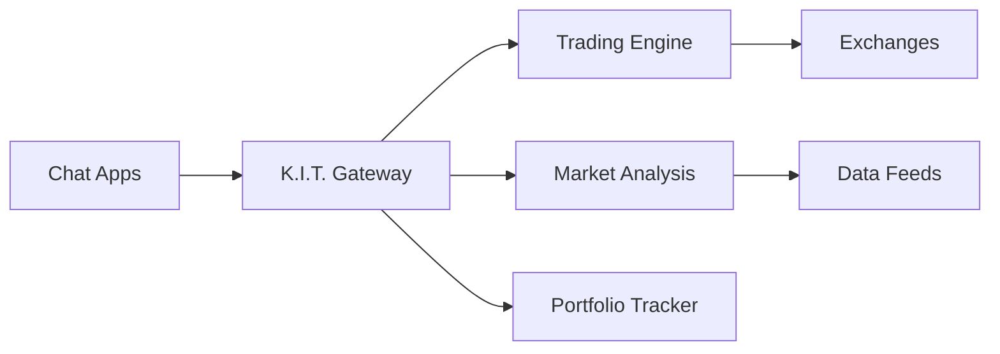

# K.I.T. 🏎️💰

<p align="center">
  <strong>Knight Industries Trading</strong>
</p>

> _"Ich bin K.I.T.T., aber für dein Portfolio."_ — K.I.T.

<p align="center">
  <strong>KI-gesteuerter Trading-Assistent für Crypto, Forex und traditionelle Märkte.</strong><br />
  Sende eine Nachricht, erhalte Marktanalysen, Alerts und automatische Trades.
</p>

<Columns>
  <Card title="Schnellstart" href="/start/installation" icon="rocket">
    Installiere K.I.T. und starte in wenigen Minuten.
  </Card>
  <Card title="Erster Trade" href="/start/first-trade" icon="trending-up">
    Führe deinen ersten Trade mit K.I.T. durch.
  </Card>
  <Card title="Exchanges verbinden" href="/start/exchanges" icon="link">
    Verbinde deine Börsen-Accounts sicher.
  </Card>
</Columns>

## Was ist K.I.T.?

K.I.T. ist ein **KI-gesteuerter Trading-Assistent**, der auf OpenClaw basiert. Er verbindet sich mit deinen bevorzugten Messaging-Apps (Telegram, Discord, Signal) und bietet dir:

- **Echtzeit-Marktanalysen** mit KI-gestützter Interpretation
- **Automatische Trading-Signale** basierend auf technischer und fundamentaler Analyse
- **Portfolio-Tracking** über alle verbundenen Exchanges
- **Risiko-Management** mit automatischen Stop-Loss und Take-Profit Orders
- **Backtesting** für deine Trading-Strategien

**Für wen ist K.I.T.?** Trader und Investoren, die einen intelligenten Assistenten wollen, der 24/7 die Märkte überwacht — ohne ständig auf Charts starren zu müssen.

**Was macht K.I.T. besonders?**

- **Multi-Exchange**: Binance, Kraken, Coinbase, MetaTrader und mehr
- **Multi-Channel**: Telegram, Discord, Signal als Kommunikationskanäle
- **KI-Native**: Natürliche Sprachverarbeitung für Trading-Befehle
- **Open Source**: MIT-lizenziert, Community-getrieben

## So funktioniert K.I.T.



K.I.T. ist das zentrale Gehirn, das alle deine Trading-Aktivitäten koordiniert.

## Kernfunktionen

<Columns>
  <Card title="Multi-Exchange Support" icon="building">
    Binance, Kraken, Coinbase, MetaTrader mit einer einzigen Konfiguration.
  </Card>
  <Card title="Intelligente Alerts" icon="bell">
    Preis-Alerts, Volumen-Spikes, Trend-Änderungen automatisch erkennen.
  </Card>
  <Card title="Auto-Trading" icon="bot">
    Definiere Strategien und lass K.I.T. automatisch handeln.
  </Card>
  <Card title="Portfolio-Tracking" icon="pie-chart">
    Echtzeit-Übersicht über alle deine Assets.
  </Card>
  <Card title="Backtesting" icon="history">
    Teste Strategien mit historischen Daten.
  </Card>
  <Card title="Risiko-Management" icon="shield">
    Automatische Stop-Loss, Position-Sizing, Drawdown-Limits.
  </Card>
</Columns>

## Schnellstart

<Steps>
  <Step title="K.I.T. installieren">
    ```bash
    npm install -g kit-trading@latest
    ```
  </Step>
  <Step title="Konfiguration erstellen">
    ```bash
    kit init
    kit configure --exchange binance
    ```
  </Step>
  <Step title="Exchange verbinden">
    ```bash
    kit exchanges add binance --api-key YOUR_KEY --secret YOUR_SECRET
    ```
  </Step>
  <Step title="Telegram verbinden">
    ```bash
    kit channels login telegram
    ```
  </Step>
</Steps>

Detaillierte Anleitung: [Installation](/start/installation)

## Beispiel-Befehle

```
📊 Portfolio anzeigen
> "Zeig mir mein Portfolio"

📈 Marktanalyse
> "Analysiere BTC/USDT"

🚨 Alert setzen
> "Alert wenn ETH über 3000$"

🤖 Auto-Trade aktivieren
> "Kaufe 0.1 BTC wenn RSI unter 30"
```

## Konfiguration

Die Konfiguration liegt in `~/.kit/config.json`:

```json5
{
  exchanges: {
    binance: {
      apiKey: "...",
      apiSecret: "...",
      testnet: false
    }
  },
  risk: {
    maxPositionSize: 0.1,  // 10% des Portfolios
    maxDailyLoss: 0.05,    // 5% max Tagesverlust
    stopLossDefault: 0.02  // 2% Stop-Loss
  },
  channels: {
    telegram: {
      allowFrom: ["@your_username"]
    }
  }
}
```

## Navigation

<Columns>
  <Card title="Getting Started" href="/start/installation" icon="book-open">
    Installation, Konfiguration und erster Trade.
  </Card>
  <Card title="Core Concepts" href="/concepts/architecture" icon="cpu">
    Architektur, Skills und Trading-Tools verstehen.
  </Card>
  <Card title="Skills" href="/skills/exchange-connector" icon="plug">
    Exchange-Connector, Portfolio-Tracker, Auto-Trader.
  </Card>
  <Card title="Exchanges" href="/exchanges/binance" icon="building">
    Binance, Kraken, Coinbase, MetaTrader Setup.
  </Card>
  <Card title="Channels" href="/channels/telegram" icon="message-square">
    Telegram, Discord, Signal Konfiguration.
  </Card>
  <Card title="Security" href="/security/api-keys" icon="shield">
    API-Keys, Berechtigungen, Best Practices.
  </Card>
</Columns>

## Weiterführend

<Columns>
  <Card title="Risiko-Management" href="/concepts/risk-management" icon="alert-triangle">
    Stop-Loss, Position-Sizing, Drawdown-Schutz.
  </Card>
  <Card title="Backtesting" href="/skills/backtester" icon="history">
    Strategien mit historischen Daten testen.
  </Card>
  <Card title="Market Analysis" href="/skills/market-analysis" icon="bar-chart">
    Technische und fundamentale Analyse.
  </Card>
  <Card title="Auto-Trader" href="/skills/auto-trader" icon="bot">
    Automatische Trading-Strategien.
  </Card>
</Columns>

---

<Warning>
**Risiko-Hinweis:** Trading birgt erhebliche Risiken. K.I.T. ist ein Tool, keine Finanzberatung. Investiere nur Geld, das du bereit bist zu verlieren.
</Warning>
