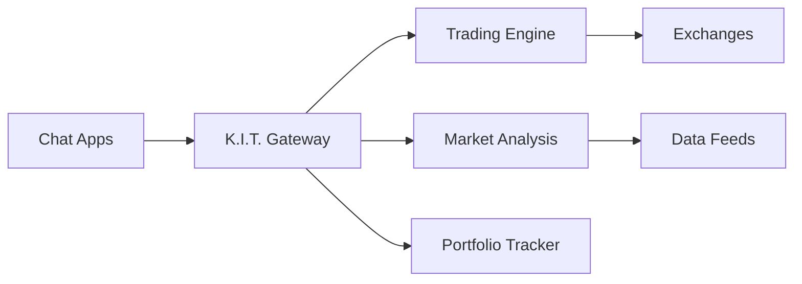

# K.I.T. 🏎️💰

<p align="center">
  <strong>Knight Industries Trading</strong>
</p>

> _"I'm K.I.T.T., but for your portfolio."_ — K.I.T.

<p align="center">
  <strong>AI-powered trading assistant for Crypto, Forex, and traditional markets.</strong><br />
  Send a message, receive market analysis, alerts, and automatic trades.
</p>

<Columns>
  <Card title="Quickstart" href="/start/installation" icon="rocket">
    Install K.I.T. and get started in minutes.
  </Card>
  <Card title="First Trade" href="/start/first-trade" icon="trending-up">
    Execute your first trade with K.I.T.
  </Card>
  <Card title="Connect Exchanges" href="/start/exchanges" icon="link">
    Securely connect your exchange accounts.
  </Card>
</Columns>

## What is K.I.T.?

K.I.T. is an **AI-powered trading assistant** built on OpenClaw. It connects to your favorite messaging apps (Telegram, Discord, Signal) and provides:

- **Real-time market analysis** with AI-powered interpretation
- **Automatic trading signals** based on technical and fundamental analysis
- **Portfolio tracking** across all connected exchanges
- **Risk management** with automatic stop-loss and take-profit orders
- **Backtesting** for your trading strategies

**Who is K.I.T. for?** Traders and investors who want an intelligent assistant that monitors markets 24/7 — without having to constantly stare at charts.

**What makes K.I.T. special?**

- **Multi-Exchange**: Binance, Kraken, Coinbase, MetaTrader and more
- **Multi-Channel**: Telegram, Discord, Signal as communication channels
- **AI-Native**: Natural language processing for trading commands
- **Open Source**: MIT-licensed, community-driven

## How K.I.T. Works



K.I.T. is the central brain that coordinates all your trading activities.

## Core Features

<Columns>
  <Card title="Multi-Exchange Support" icon="building">
    Binance, Kraken, Coinbase, MetaTrader with a single configuration.
  </Card>
  <Card title="Intelligent Alerts" icon="bell">
    Automatically detect price alerts, volume spikes, and trend changes.
  </Card>
  <Card title="Auto-Trading" icon="bot">
    Define strategies and let K.I.T. trade automatically.
  </Card>
  <Card title="Portfolio Tracking" icon="pie-chart">
    Real-time overview of all your assets.
  </Card>
  <Card title="Backtesting" icon="history">
    Test strategies with historical data.
  </Card>
  <Card title="Risk Management" icon="shield">
    Automatic stop-loss, position sizing, drawdown limits.
  </Card>
</Columns>

## Quickstart

<Steps>
  <Step title="Install K.I.T.">
    ```bash
    npm install -g kit-trading@latest
    ```
  </Step>
  <Step title="Create configuration">
    ```bash
    kit init
    kit configure --exchange binance
    ```
  </Step>
  <Step title="Connect exchange">
    ```bash
    kit exchanges add binance --api-key YOUR_KEY --secret YOUR_SECRET
    ```
  </Step>
  <Step title="Connect Telegram">
    ```bash
    kit channels login telegram
    ```
  </Step>
</Steps>

Detailed guide: [Installation](/start/installation)

## Example Commands

```
📊 Show portfolio
> "Show me my portfolio"

📈 Market analysis
> "Analyze BTC/USDT"

🚨 Set alert
> "Alert when ETH above $3000"

🤖 Activate auto-trade
> "Buy 0.1 BTC when RSI below 30"
```

## Configuration

The configuration is located in `~/.kit/config.json`:

```json5
{
  exchanges: {
    binance: {
      apiKey: "...",
      apiSecret: "...",
      testnet: false
    }
  },
  risk: {
    maxPositionSize: 0.1,  // 10% of portfolio
    maxDailyLoss: 0.05,    // 5% max daily loss
    stopLossDefault: 0.02  // 2% stop-loss
  },
  channels: {
    telegram: {
      allowFrom: ["@your_username"]
    }
  }
}
```

## Navigation

<Columns>
  <Card title="Getting Started" href="/start/installation" icon="book-open">
    Installation, configuration, and first trade.
  </Card>
  <Card title="Windows Installation" href="/start/windows-installation" icon="windows">
    Detailed Windows 10/11 guide.
  </Card>
  <Card title="API Reference" href="/api/api-reference" icon="code">
    Complete API documentation.
  </Card>
  <Card title="Core Concepts" href="/concepts/architecture" icon="cpu">
    Understand architecture, skills, and trading tools.
  </Card>
  <Card title="Skills" href="/skills/exchange-connector" icon="plug">
    Exchange connector, portfolio tracker, auto-trader.
  </Card>
  <Card title="Exchanges" href="/exchanges/binance" icon="building">
    Binance, Kraken, Coinbase, MetaTrader setup.
  </Card>
  <Card title="Channels" href="/channels/telegram" icon="message-square">
    Telegram, Discord, Signal configuration.
  </Card>
  <Card title="Security" href="/security/api-keys" icon="shield">
    API keys, permissions, best practices.
  </Card>
</Columns>

## Learn More

<Columns>
  <Card title="Risk Management" href="/concepts/risk-management" icon="alert-triangle">
    Stop-loss, position sizing, drawdown protection.
  </Card>
  <Card title="Backtesting" href="/skills/backtester" icon="history">
    Test strategies with historical data.
  </Card>
  <Card title="Market Analysis" href="/skills/market-analysis" icon="bar-chart">
    Technical and fundamental analysis.
  </Card>
  <Card title="Auto-Trader" href="/skills/auto-trader" icon="bot">
    Automatic trading strategies.
  </Card>
</Columns>

---

<Warning>
**Risk Disclaimer:** Trading involves significant risks. K.I.T. is a tool, not financial advice. Only invest money you are prepared to lose.
</Warning>
