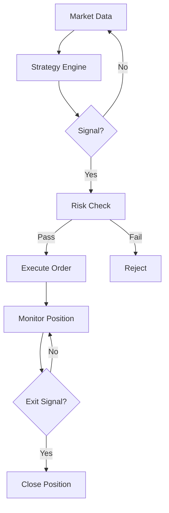

# Auto-Trader

The Auto-Trader executes predefined trading strategies automatically. You define the rules, K.I.T. trades.

<Warning>
**Risk Disclaimer:** Automatic trading can lead to significant losses. Thoroughly test every strategy with backtesting and paper trading before using real capital.
</Warning>

## Overview



## Built-in Strategies

### Trend Following

Follows established trends with moving averages.

```json
{
  "strategy": "trend-following",
  "params": {
    "fastMA": 20,
    "slowMA": 50,
    "confirmationCandles": 2,
    "stopLoss": 0.02,
    "takeProfit": 0.06
  }
}
```

**Signals:**
- **Long:** Fast MA crosses above Slow MA
- **Short:** Fast MA crosses below Slow MA

### Mean Reversion

Trades return to mean on overextensions.

```json
{
  "strategy": "mean-reversion",
  "params": {
    "rsiPeriod": 14,
    "rsiBuyLevel": 30,
    "rsiSellLevel": 70,
    "bollingerPeriod": 20,
    "bollingerStdDev": 2
  }
}
```

**Signals:**
- **Long:** RSI < 30 OR Price below lower BB
- **Short:** RSI > 70 OR Price above upper BB

### Breakout

Trades breakouts from consolidations.

```json
{
  "strategy": "breakout",
  "params": {
    "lookbackPeriod": 20,
    "volumeMultiplier": 1.5,
    "breakoutThreshold": 0.02
  }
}
```

### Grid Trading

Places orders in a price grid.

```json
{
  "strategy": "grid",
  "params": {
    "upperPrice": 70000,
    "lowerPrice": 60000,
    "gridLevels": 10,
    "orderSize": 100
  }
}
```

### DCA (Dollar Cost Averaging)

Regular purchases regardless of price.

```json
{
  "strategy": "dca",
  "params": {
    "amount": 100,
    "interval": "weekly",
    "day": "monday",
    "time": "09:00"
  }
}
```

## Start Strategy

### Via CLI

```bash
# Start strategy
kit auto-trader start trend-following \
  --pair BTC/USDT \
  --capital 1000

# With custom parameters
kit auto-trader start mean-reversion \
  --pair ETH/USDT \
  --capital 500 \
  --rsi-buy 25 \
  --rsi-sell 75
```

### Via Telegram

```
"Start trend-following for BTC with $1000"
"Auto-trade mean-reversion on ETH"
```

## Strategy Management

```bash
# Show active strategies
kit auto-trader status

# Pause strategy
kit auto-trader pause trend-following-btc

# Resume strategy
kit auto-trader resume trend-following-btc

# Stop strategy
kit auto-trader stop trend-following-btc

# Stop all
kit auto-trader stop-all
```

## Status Dashboard

```bash
kit auto-trader dashboard
```

```
🤖 Auto-Trader Dashboard
═══════════════════════════════════════
Active Strategies: 3

┌─────────────────────────────────────────────────┐
│ #1 Trend-Following (BTC/USDT)                   │
├─────────────────────────────────────────────────┤
│ Status: 🟢 Active                               │
│ Capital: $1,000 | Position: Long $500           │
│ PnL: +$52.30 (+5.23%)                          │
│ Trades: 12 | Win Rate: 67%                      │
│ Runtime: 7 days                                 │
└─────────────────────────────────────────────────┘

┌─────────────────────────────────────────────────┐
│ #2 Mean-Reversion (ETH/USDT)                    │
├─────────────────────────────────────────────────┤
│ Status: ⏳ Waiting for signal                   │
│ Capital: $500 | Position: None                  │
│ PnL: +$23.50 (+4.7%)                           │
│ Trades: 8 | Win Rate: 62%                       │
│ Runtime: 5 days                                 │
└─────────────────────────────────────────────────┘

┌─────────────────────────────────────────────────┐
│ #3 DCA (BTC/USDT)                               │
├─────────────────────────────────────────────────┤
│ Status: 🟢 Active                               │
│ Invested: $400 | Next buy: Mon 09:00            │
│ Avg Entry: $65,200 | Current: $67,500           │
│ PnL: +$14.00 (+3.5%)                           │
└─────────────────────────────────────────────────┘

Total PnL: +$89.80 (+5.98%)
```

## Create Custom Strategy

### Strategy File

```json
// ~/.kit/strategies/my-strategy.json
{
  "name": "my-strategy",
  "version": "1.0.0",
  "description": "My custom strategy",
  "timeframe": "4h",
  "pairs": ["BTC/USDT", "ETH/USDT"],
  
  "entry": {
    "conditions": [
      { "indicator": "rsi", "period": 14, "operator": "<", "value": 30 },
      { "indicator": "macd", "signal": "bullish-crossover" },
      { "indicator": "volume", "operator": ">", "value": "150%" }
    ],
    "logic": "AND"
  },
  
  "exit": {
    "takeProfit": 0.06,
    "stopLoss": 0.02,
    "trailingStop": {
      "activation": 0.03,
      "distance": 0.015
    },
    "conditions": [
      { "indicator": "rsi", "period": 14, "operator": ">", "value": 70 }
    ]
  },
  
  "riskManagement": {
    "maxPositionSize": 0.1,
    "maxOpenTrades": 2,
    "riskPerTrade": 0.01
  }
}
```

### Register Strategy

```bash
kit auto-trader add-strategy ./my-strategy.json
kit auto-trader list-strategies
```

### Strategy with Code (Advanced)

```typescript
// ~/.kit/strategies/custom/index.ts
import { Strategy, Signal, Context } from '@kit/auto-trader';

export const myStrategy: Strategy = {
  name: 'my-custom-strategy',
  
  async analyze(ctx: Context): Promise<Signal | null> {
    const { candles, indicators } = ctx;
    
    const rsi = indicators.rsi(14);
    const macd = indicators.macd(12, 26, 9);
    
    if (rsi < 30 && macd.histogram > 0) {
      return {
        type: 'long',
        confidence: 0.8,
        entry: candles.close,
        stopLoss: candles.close * 0.98,
        takeProfit: candles.close * 1.06
      };
    }
    
    return null;
  }
};
```

## Backtest Before Live

Before a strategy goes live:

```bash
# Run backtest
kit backtest my-strategy \
  --pair BTC/USDT \
  --from 2023-01-01 \
  --to 2024-01-01

# Test with paper trading
kit auto-trader start my-strategy \
  --pair BTC/USDT \
  --paper
```

## Notifications

```json
{
  "autoTrader": {
    "notifications": {
      "onSignal": true,
      "onTrade": true,
      "onStopLoss": true,
      "onTakeProfit": true,
      "dailySummary": "18:00"
    }
  }
}
```

Trade notification:
```
🤖 Auto-Trader: Trade executed
═══════════════════════════════════════
Strategy: Trend-Following
Action: LONG BTC/USDT

Entry: $67,200
Stop-Loss: $65,856 (-2%)
Take-Profit: $71,232 (+6%)

Position: $500 (5% Portfolio)
```

## Safety Features

### Kill Switch

```json
{
  "autoTrader": {
    "killSwitch": {
      "maxDailyLoss": 0.05,
      "maxConsecutiveLosses": 5,
      "emergencyStop": true
    }
  }
}
```

### Manual Override

```bash
# Stop all auto-trades immediately
kit auto-trader emergency-stop

# Override specific strategy
kit auto-trader override trend-following --close-all
```

## Performance Tracking

```bash
kit auto-trader performance
kit auto-trader performance --strategy trend-following
```

```
📊 Auto-Trader Performance
═══════════════════════════════════════
Period: 30 days

Strategy         Trades  Win%   PnL      Sharpe
────────────────────────────────────────────────
Trend-Following  24      67%    +8.5%    1.8
Mean-Reversion   18      56%    +3.2%    1.2
DCA              4       75%    +5.1%    N/A
────────────────────────────────────────────────
Total            46      64%    +6.2%    1.5
```

## Next Steps

<Columns>
  <Card title="Backtester" href="/skills/backtester" icon="history">
    Test strategies.
  </Card>
  <Card title="Risk Management" href="/concepts/risk-management" icon="shield">
    Risk control.
  </Card>
  <Card title="Market Analysis" href="/skills/market-analysis" icon="bar-chart">
    Analysis for better strategies.
  </Card>
</Columns>
