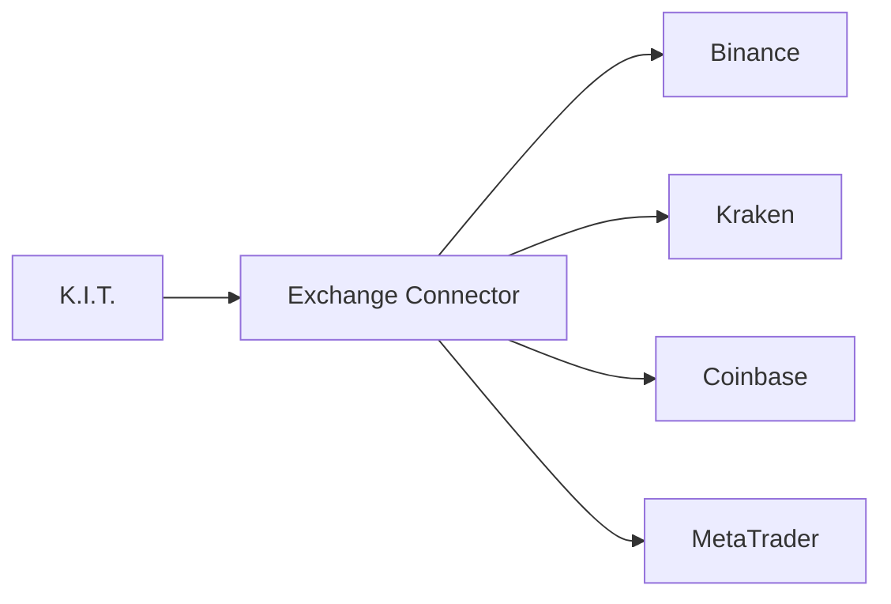

# Exchange Connector

The Exchange Connector is the heart of all exchange interactions. It abstracts various exchange APIs into a unified interface.

## Overview



## Supported Exchanges

| Exchange | Spot | Futures | Margin | Status |
|----------|------|---------|--------|--------|
| Binance | ✅ | ✅ | ✅ | Stable |
| Kraken | ✅ | ✅ | ❌ | Stable |
| Coinbase | ✅ | ❌ | ❌ | Stable |
| MetaTrader | N/A | N/A | ✅ | Stable |
| Bybit | ✅ | ✅ | ✅ | Beta |
| KuCoin | ✅ | ✅ | ✅ | Beta |
| OKX | ✅ | ✅ | ✅ | Beta |

## Commands

### Query Balance

```bash
kit balance
kit balance binance
kit balance --all
```

Telegram:
```
"Show my balance"
"Balance on Binance"
```

### Place Order

```bash
# Market Order
kit buy BTC/USDT 100

# Limit Order
kit buy BTC/USDT 100 --price 65000

# Sell Order
kit sell ETH/USDT 0.5 --price 3500
```

### Cancel Order

```bash
kit cancel <order-id>
kit cancel --all BTC/USDT
```

### Order Status

```bash
kit orders
kit orders --open
kit orders --history --limit 20
```

## API Functions

### getBalance()

```typescript
const balance = await exchange.getBalance();

// Result:
{
  total: { BTC: 0.5, ETH: 2.0, USDT: 5000 },
  free: { BTC: 0.3, ETH: 1.5, USDT: 5000 },
  used: { BTC: 0.2, ETH: 0.5, USDT: 0 }
}
```

### createOrder()

```typescript
const order = await exchange.createOrder({
  symbol: 'BTC/USDT',
  type: 'limit',
  side: 'buy',
  amount: 0.01,
  price: 65000
});

// Result:
{
  id: '12345',
  symbol: 'BTC/USDT',
  type: 'limit',
  side: 'buy',
  amount: 0.01,
  price: 65000,
  status: 'open',
  filled: 0,
  remaining: 0.01,
  timestamp: 1705312800000
}
```

### fetchOHLCV()

```typescript
const candles = await exchange.fetchOHLCV('BTC/USDT', '1h', 100);

// Result: Array of [timestamp, open, high, low, close, volume]
[
  [1705312800000, 67000, 67500, 66800, 67200, 1250.5],
  [1705316400000, 67200, 67800, 67100, 67600, 980.3],
  ...
]
```

### fetchTicker()

```typescript
const ticker = await exchange.fetchTicker('BTC/USDT');

// Result:
{
  symbol: 'BTC/USDT',
  bid: 67150,
  ask: 67160,
  last: 67155,
  high: 68000,
  low: 66500,
  volume: 25000,
  change: 1.2,
  percentage: 1.82
}
```

## Configuration

```json
{
  "skills": {
    "exchange-connector": {
      "defaultExchange": "binance",
      "timeout": 30000,
      "retries": 3,
      "rateLimit": true,
      "sandbox": false
    }
  }
}
```

## Multi-Exchange Trading

### Primary and Backup Exchange

```json
{
  "exchanges": {
    "binance": { "priority": 1 },
    "kraken": { "priority": 2 }
  },
  "routing": {
    "failover": true,
    "latencyBased": false
  }
}
```

### Arbitrage Support

```bash
kit arb BTC/USDT --exchanges binance,kraken
```

## WebSocket Streams

Real-time updates via WebSocket:

```typescript
// Subscribe to price updates
exchange.subscribe('ticker', 'BTC/USDT', (ticker) => {
  console.log(`BTC: ${ticker.last}`);
});

// Trade updates
exchange.subscribe('trades', 'BTC/USDT', (trade) => {
  console.log(`Trade: ${trade.side} ${trade.amount} @ ${trade.price}`);
});

// Order updates
exchange.subscribe('orders', (order) => {
  console.log(`Order ${order.id}: ${order.status}`);
});
```

## Error Handling

```typescript
try {
  await exchange.createOrder(...);
} catch (error) {
  if (error.code === 'INSUFFICIENT_FUNDS') {
    // Not enough balance
  } else if (error.code === 'RATE_LIMIT') {
    // Too many requests
  } else if (error.code === 'INVALID_ORDER') {
    // Invalid order parameters
  }
}
```

## Rate Limiting

K.I.T. handles rate limits automatically:

```json
{
  "exchanges": {
    "binance": {
      "rateLimit": {
        "orders": 10,      // Orders per second
        "requests": 1200,  // Requests per minute
        "weight": 1200     // Weighted limit
      }
    }
  }
}
```

## Testnet/Sandbox

For paper trading:

```bash
kit exchanges add binance --testnet
```

```json
{
  "exchanges": {
    "binance": {
      "testnet": true,
      "baseUrl": "https://testnet.binance.vision"
    }
  }
}
```

## Troubleshooting

<AccordionGroup>
  <Accordion title="Connection Timeout">
    ```bash
    kit config set exchanges.binance.timeout 60000
    kit exchanges test binance
    ```
  </Accordion>
  
  <Accordion title="Invalid Signature">
    - Check time difference: `kit exchanges sync-time`
    - Regenerate API key
    - Secret copied correctly?
  </Accordion>
  
  <Accordion title="Insufficient Balance">
    ```bash
    kit balance binance
    # Check if funds on Spot/Futures/Margin
    kit balance binance --type spot
    kit balance binance --type futures
    ```
  </Accordion>
</AccordionGroup>

## Next Steps

<Columns>
  <Card title="Set up Exchanges" href="/start/exchanges" icon="link">
    Connect new exchange.
  </Card>
  <Card title="Portfolio Tracker" href="/skills/portfolio-tracker" icon="pie-chart">
    Portfolio overview.
  </Card>
  <Card title="Binance Details" href="/exchanges/binance" icon="building">
    Binance-specific features.
  </Card>
</Columns>
