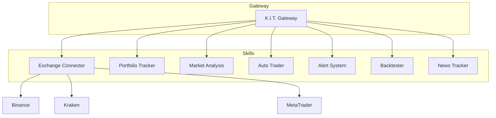

# Skills - K.I.T.'s Fähigkeiten

Skills sind modulare Erweiterungen, die K.I.T. seine Fähigkeiten verleihen. Jeder Skill ist unabhängig und kann aktiviert/deaktiviert werden.

## Architektur



## Verfügbare Skills

### 🔌 Exchange Connector
**Status:** ✅ Stabil

Verbindet K.I.T. mit Börsen und Brokern.

| Feature | Beschreibung |
|---------|--------------|
| Multi-Exchange | Gleichzeitig mehrere Börsen |
| Unified API | Einheitliches Interface für alle Exchanges |
| WebSocket | Echtzeit-Preisstreams |
| Rate Limiting | Automatisches Throttling |

**Unterstützt:** Binance, Kraken, Coinbase, OKX, Bybit, MetaTrader 4/5

[📖 Dokumentation →](/skills/exchange-connector)

---

### 💼 Portfolio Tracker
**Status:** ✅ Stabil

Verfolgt dein gesamtes Portfolio über alle Exchanges.

| Feature | Beschreibung |
|---------|--------------|
| Consolidation | Alle Assets in einer Ansicht |
| P&L Tracking | Gewinn/Verlust pro Position |
| Allocation | Portfolio-Verteilung |
| History | Historische Performance |

**Tools:**
- `kit portfolio` - Übersicht
- `kit portfolio pnl` - P&L-Analyse
- `kit portfolio history` - Verlauf

[📖 Dokumentation →](/skills/portfolio-tracker)

---

### 📈 Market Analysis
**Status:** ✅ Stabil

Technische Analyse und Marktdaten.

| Feature | Beschreibung |
|---------|--------------|
| Indicators | RSI, MACD, Bollinger, MA, etc. |
| Pattern | Candlestick-Muster erkennen |
| Support/Resistance | Automatische Level-Erkennung |
| Signals | Buy/Sell-Signale generieren |

**Tools:**
- `kit analyze <pair>` - Vollanalyse
- `kit market <pair>` - Marktdaten
- `kit chart <pair>` - Chart-Daten

[📖 Dokumentation →](/skills/market-analysis)

---

### 🤖 Auto Trader
**Status:** ✅ Stabil

Automatisierte Strategieausführung.

| Feature | Beschreibung |
|---------|--------------|
| Strategies | Vordefinierte & eigene Strategien |
| Risk Management | Stop-Loss, Take-Profit, Position-Sizing |
| Approval Mode | Manuell, Semi-Auto, Full-Auto |
| Logging | Jede Entscheidung dokumentiert |

**Modi:**
1. **Manual** - Jeder Trade braucht Bestätigung
2. **Semi-Auto** - Kleine Trades automatisch
3. **Full-Auto** - Alles automatisch

[📖 Dokumentation →](/skills/auto-trader)

---

### 🔔 Alert System
**Status:** ✅ Stabil

Benachrichtigungen bei Preisbewegungen und Events.

| Feature | Beschreibung |
|---------|--------------|
| Price Alerts | Über/unter Preis |
| Indicator Alerts | RSI, MACD, etc. |
| Portfolio Alerts | Drawdown, Exposure |
| Multi-Channel | Telegram, Discord, Email |

**Tools:**
- `kit alert list` - Alle Alerts
- `kit alert price BTC above 70000` - Preis-Alert
- `kit alert rsi BTC below 30` - Indikator-Alert

[📖 Dokumentation →](/skills/alert-system)

---

### ⏮️ Backtester
**Status:** ✅ Stabil

Strategien mit historischen Daten testen.

| Feature | Beschreibung |
|---------|--------------|
| Historical Data | Multi-Timeframe OHLCV |
| Metrics | Sharpe, Sortino, Max DD, etc. |
| Visualization | Equity-Kurve, Drawdown-Chart |
| Optimization | Parameter-Optimierung |

**Tools:**
- `kit backtest --strategy ma_cross` - Backtest starten
- `kit backtest list` - Verfügbare Strategien
- `kit backtest report <id>` - Ergebnis anzeigen

[📖 Dokumentation →](/skills/backtester)

---

### 📰 News Tracker
**Status:** 🚧 Beta

Nachrichten und Sentiment-Analyse.

| Feature | Beschreibung |
|---------|--------------|
| News Aggregation | Crypto, Forex, Stocks |
| Sentiment | AI-basierte Sentiment-Erkennung |
| Impact Analysis | Auswirkung auf Assets |
| Alerts | Breaking News Benachrichtigungen |

**Quellen:** CoinDesk, CoinTelegraph, Bloomberg, Reuters

[📖 Dokumentation →](/skills/news-tracker)

---

## Skill aktivieren/deaktivieren

### Per CLI

```bash
# Skill aktivieren
kit skills enable backtester

# Skill deaktivieren
kit skills disable news-tracker

# Skill-Status anzeigen
kit skills status
```

### Per Config

```json
{
  "skills": {
    "exchange-connector": { "enabled": true },
    "portfolio-tracker": { "enabled": true },
    "market-analysis": { "enabled": true },
    "auto-trader": { "enabled": true },
    "alert-system": { "enabled": true },
    "backtester": { "enabled": true },
    "news-tracker": { "enabled": false }
  }
}
```

## Eigene Skills entwickeln

Skills folgen einer standardisierten Struktur:

```
my-skill/
├── index.ts          # Einstiegspunkt
├── SKILL.md          # Dokumentation
├── package.json      # Metadaten
└── config.schema.json # Konfiguration
```

### Skill Template

```typescript
// index.ts
import { Skill, SkillContext } from '@binaryfaster/kit';

export default class MySkill implements Skill {
  id = 'my-skill';
  name = 'My Custom Skill';
  version = '1.0.0';
  
  async init(ctx: SkillContext): Promise<void> {
    // Initialisierung
  }
  
  async execute(action: string, params: any): Promise<any> {
    switch (action) {
      case 'myAction':
        return this.handleMyAction(params);
      default:
        throw new Error(`Unknown action: ${action}`);
    }
  }
  
  private async handleMyAction(params: any): Promise<any> {
    // Implementierung
    return { success: true };
  }
}
```

### Skill installieren

```bash
# Aus npm
kit skills install @binaryfaster/kit-skill-myskill

# Lokal
kit skills install ./path/to/my-skill
```

## Skill-Interaktion

Skills können miteinander kommunizieren:

```typescript
// In einem Skill
const price = await this.ctx.invokeSkill('market-analysis', 'getPrice', {
  pair: 'BTC/USDT'
});

const order = await this.ctx.invokeSkill('exchange-connector', 'createOrder', {
  pair: 'BTC/USDT',
  side: 'buy',
  amount: 0.01,
  type: 'market'
});
```

## Roadmap

| Skill | Status | ETA |
|-------|--------|-----|
| DeFi Connector | 📋 Geplant | Q2 2026 |
| Tax Reporter | 📋 Geplant | Q2 2026 |
| Social Trading | 📋 Geplant | Q3 2026 |
| ML Predictor | 📋 Geplant | Q3 2026 |

---

<Tip>
**Tipp:** Starte mit den Core-Skills (Exchange Connector, Portfolio Tracker, Market Analysis) und aktiviere weitere nach Bedarf.
</Tip>
