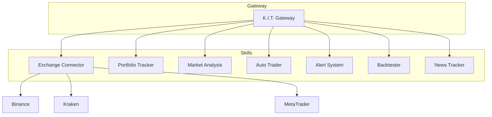

# Skills - K.I.T.'s Capabilities

Skills are modular extensions that give K.I.T. its capabilities. Each skill is independent and can be enabled/disabled.

## Architecture



## Available Skills

### 🔌 Exchange Connector
**Status:** ✅ Stable

Connects K.I.T. to exchanges and brokers.

| Feature | Description |
|---------|-------------|
| Multi-Exchange | Multiple exchanges simultaneously |
| Unified API | Unified interface for all exchanges |
| WebSocket | Real-time price streams |
| Rate Limiting | Automatic throttling |

**Supported:** Binance, Kraken, Coinbase, OKX, Bybit, MetaTrader 4/5

[📖 Documentation →](/skills/exchange-connector)

---

### 💼 Portfolio Tracker
**Status:** ✅ Stable

Tracks your entire portfolio across all exchanges.

| Feature | Description |
|---------|-------------|
| Consolidation | All assets in one view |
| P&L Tracking | Profit/loss per position |
| Allocation | Portfolio distribution |
| History | Historical performance |

**Tools:**
- `kit portfolio` - Overview
- `kit portfolio pnl` - P&L analysis
- `kit portfolio history` - History

[📖 Documentation →](/skills/portfolio-tracker)

---

### 📈 Market Analysis
**Status:** ✅ Stable

Technical analysis and market data.

| Feature | Description |
|---------|-------------|
| Indicators | RSI, MACD, Bollinger, MA, etc. |
| Pattern | Candlestick pattern detection |
| Support/Resistance | Automatic level detection |
| Signals | Generate buy/sell signals |

**Tools:**
- `kit analyze <pair>` - Full analysis
- `kit market <pair>` - Market data
- `kit chart <pair>` - Chart data

[📖 Documentation →](/skills/market-analysis)

---

### 🤖 Auto Trader
**Status:** ✅ Stable

Automated strategy execution.

| Feature | Description |
|---------|-------------|
| Strategies | Predefined & custom strategies |
| Risk Management | Stop-loss, take-profit, position sizing |
| Approval Mode | Manual, semi-auto, full-auto |
| Logging | Every decision documented |

**Modes:**
1. **Manual** - Every trade needs confirmation
2. **Semi-Auto** - Small trades automatic
3. **Full-Auto** - Everything automatic

[📖 Documentation →](/skills/auto-trader)

---

### 🔔 Alert System
**Status:** ✅ Stable

Notifications for price movements and events.

| Feature | Description |
|---------|-------------|
| Price Alerts | Above/below price |
| Indicator Alerts | RSI, MACD, etc. |
| Portfolio Alerts | Drawdown, exposure |
| Multi-Channel | Telegram, Discord, Email |

**Tools:**
- `kit alert list` - All alerts
- `kit alert price BTC above 70000` - Price alert
- `kit alert rsi BTC below 30` - Indicator alert

[📖 Documentation →](/skills/alert-system)

---

### ⏮️ Backtester
**Status:** ✅ Stable

Test strategies with historical data.

| Feature | Description |
|---------|-------------|
| Historical Data | Multi-timeframe OHLCV |
| Metrics | Sharpe, Sortino, Max DD, etc. |
| Visualization | Equity curve, drawdown chart |
| Optimization | Parameter optimization |

**Tools:**
- `kit backtest --strategy ma_cross` - Start backtest
- `kit backtest list` - Available strategies
- `kit backtest report <id>` - Show result

[📖 Documentation →](/skills/backtester)

---

### 📰 News Tracker
**Status:** 🚧 Beta

News and sentiment analysis.

| Feature | Description |
|---------|-------------|
| News Aggregation | Crypto, Forex, Stocks |
| Sentiment | AI-based sentiment detection |
| Impact Analysis | Impact on assets |
| Alerts | Breaking news notifications |

**Sources:** CoinDesk, CoinTelegraph, Bloomberg, Reuters

[📖 Documentation →](/skills/news-tracker)

---

## Enable/Disable Skills

### Via CLI

```bash
# Enable skill
kit skills enable backtester

# Disable skill
kit skills disable news-tracker

# Show skill status
kit skills status
```

### Via Config

```json
{
  "skills": {
    "exchange-connector": { "enabled": true },
    "portfolio-tracker": { "enabled": true },
    "market-analysis": { "enabled": true },
    "auto-trader": { "enabled": true },
    "alert-system": { "enabled": true },
    "backtester": { "enabled": true },
    "news-tracker": { "enabled": false }
  }
}
```

## Develop Custom Skills

Skills follow a standardized structure:

```
my-skill/
├── index.ts          # Entry point
├── SKILL.md          # Documentation
├── package.json      # Metadata
└── config.schema.json # Configuration
```

### Skill Template

```typescript
// index.ts
import { Skill, SkillContext } from 'kit-trading';

export default class MySkill implements Skill {
  id = 'my-skill';
  name = 'My Custom Skill';
  version = '1.0.0';
  
  async init(ctx: SkillContext): Promise<void> {
    // Initialization
  }
  
  async execute(action: string, params: any): Promise<any> {
    switch (action) {
      case 'myAction':
        return this.handleMyAction(params);
      default:
        throw new Error(`Unknown action: ${action}`);
    }
  }
  
  private async handleMyAction(params: any): Promise<any> {
    // Implementation
    return { success: true };
  }
}
```

### Install Skill

```bash
# From npm
kit skills install kit-skill-myskill

# Local
kit skills install ./path/to/my-skill
```

## Skill Interaction

Skills can communicate with each other:

```typescript
// In a skill
const price = await this.ctx.invokeSkill('market-analysis', 'getPrice', {
  pair: 'BTC/USDT'
});

const order = await this.ctx.invokeSkill('exchange-connector', 'createOrder', {
  pair: 'BTC/USDT',
  side: 'buy',
  amount: 0.01,
  type: 'market'
});
```

## Roadmap

| Skill | Status | ETA |
|-------|--------|-----|
| DeFi Connector | 📋 Planned | Q2 2026 |
| Tax Reporter | 📋 Planned | Q2 2026 |
| Social Trading | 📋 Planned | Q3 2026 |
| ML Predictor | 📋 Planned | Q3 2026 |

---

<Tip>
**Tip:** Start with the core skills (Exchange Connector, Portfolio Tracker, Market Analysis) and enable more as needed.
</Tip>
