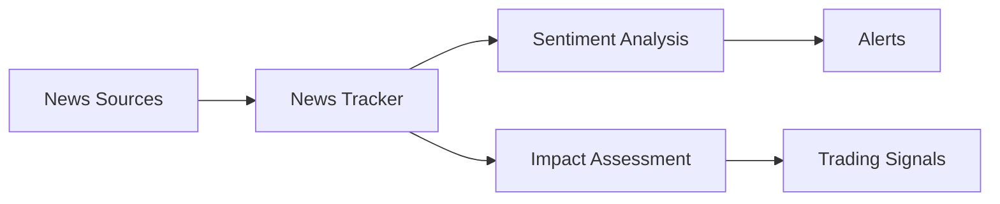

# News Tracker

The News Tracker skill aggregates financial news and analyzes sentiment to help with news-based trading decisions.

<Warning>
**Status:** 🚧 Beta - This skill is under active development. Features may change.
</Warning>

## Overview



## Features

| Feature | Description | Status |
|---------|-------------|--------|
| News Aggregation | Collect news from multiple sources | ✅ Available |
| Sentiment Analysis | AI-powered sentiment detection | ✅ Available |
| Impact Assessment | Evaluate market impact | 🚧 Beta |
| Breaking News Alerts | Instant notifications | ✅ Available |
| Historical Analysis | Past news performance | 📋 Planned |

## News Sources

| Source | Asset Types | Update Frequency |
|--------|-------------|-----------------|
| CoinDesk | Crypto | Real-time |
| CoinTelegraph | Crypto | Real-time |
| Bloomberg | All | Real-time |
| Reuters | All | Real-time |
| Decrypt | Crypto | Hourly |
| The Block | Crypto | Hourly |

## Commands

### Check Latest News

```bash
kit news
kit news --asset BTC
kit news --category crypto
```

Telegram:
```
"Show me latest crypto news"
"News about BTC"
"Any breaking news?"
```

### Set News Alerts

```bash
kit news alert --keyword "bitcoin etf"
kit news alert --asset ETH --sentiment negative
kit news alert --impact high
```

### Analyze Sentiment

```bash
kit news sentiment BTC
kit news sentiment --period 24h
```

Output:
```
📰 BTC News Sentiment (24h)
━━━━━━━━━━━━━━━━━━━━━━━━━━━━━━━━━━━━━━━━
Overall:   BULLISH 📈
Articles:  42

Breakdown:
  Positive: 25 (60%)
  Neutral:  12 (28%)
  Negative:  5 (12%)

Key Topics:
  • ETF approval speculation
  • Institutional buying
  • Mining difficulty increase
```

## Configuration

```json
{
  "skills": {
    "news-tracker": {
      "enabled": true,
      "sources": ["coindesk", "bloomberg", "reuters"],
      "assets": ["BTC", "ETH", "SOL"],
      "keywords": ["bitcoin", "ethereum", "regulation"],
      "alertThreshold": "high",
      "updateInterval": 300
    }
  }
}
```

### Configuration Options

| Option | Type | Default | Description |
|--------|------|---------|-------------|
| `enabled` | boolean | `true` | Enable/disable skill |
| `sources` | array | All | News sources to monitor |
| `assets` | array | All | Assets to track |
| `keywords` | array | `[]` | Custom keywords to monitor |
| `alertThreshold` | string | `"high"` | Alert sensitivity |
| `updateInterval` | number | `300` | Check interval (seconds) |

## Integration with Auto-Trader

The News Tracker can trigger automatic trades based on news events:

```json
{
  "autoTrade": {
    "news": {
      "enabled": false,
      "rules": [
        {
          "condition": "sentiment.negative AND impact.high",
          "action": "reduce_position",
          "amount": 0.5
        },
        {
          "condition": "keyword:'ETF approved'",
          "action": "buy",
          "amount": 500
        }
      ]
    }
  }
}
```

<Warning>
**Caution:** News-based auto-trading can be risky. News can be misleading or already priced in. Always use stop-losses.
</Warning>

## Sentiment Scoring

| Score | Label | Description |
|-------|-------|-------------|
| 0.8 - 1.0 | Very Bullish | Strong positive sentiment |
| 0.6 - 0.8 | Bullish | Positive sentiment |
| 0.4 - 0.6 | Neutral | Mixed or no clear sentiment |
| 0.2 - 0.4 | Bearish | Negative sentiment |
| 0.0 - 0.2 | Very Bearish | Strong negative sentiment |

## Best Practices

1. **Don't trade on every news** - Most news is noise
2. **Verify sources** - Fake news exists in crypto
3. **Consider timing** - Market may have already reacted
4. **Combine with technical analysis** - News + charts = better decisions
5. **Set impact thresholds** - Only alert on significant news

## Limitations

- **Latency**: News aggregation has ~30 second delay
- **Language**: Currently English only
- **Coverage**: Some smaller sources not included
- **Sentiment accuracy**: AI can misinterpret sarcasm/context

## Roadmap

| Feature | Status | ETA |
|---------|--------|-----|
| Social Media Integration | 📋 Planned | Q2 2026 |
| Multi-language Support | 📋 Planned | Q2 2026 |
| Custom News Sources | 📋 Planned | Q3 2026 |
| On-chain News Correlation | 📋 Planned | Q3 2026 |

## Related Skills

- [Market Analysis](/skills/market-analysis) - Technical analysis
- [Alert System](/skills/alert-system) - Price and indicator alerts
- [Auto Trader](/skills/auto-trader) - Automated trading

---

<Tip>
**Pro Tip:** Combine news sentiment with technical analysis for better trade timing. A bullish news event on an already oversold asset can be a strong signal.
</Tip>
