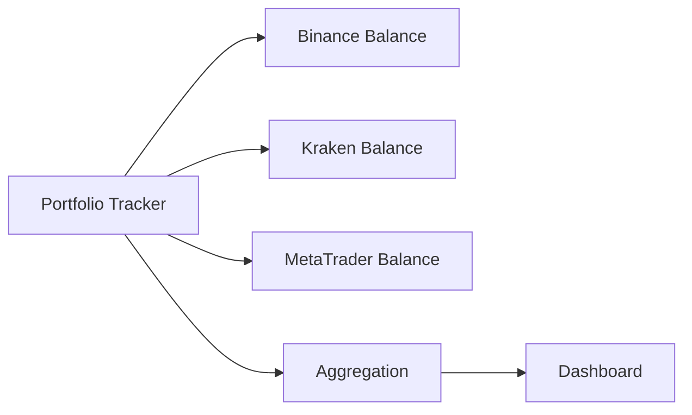

# Portfolio Tracker

The Portfolio Tracker provides a consolidated overview of all your assets across all connected exchanges.

## Overview



## Commands

### Show Portfolio

```bash
kit portfolio
kit portfolio --detailed
kit portfolio --exchange binance
```

Telegram:
```
"Show my portfolio"
"Portfolio details"
"How much do I have on Binance?"
```

Output:
```
💰 Portfolio Overview
═══════════════════════════════════════
Total: $15,432.50 (+5.2% MTD)

📊 Asset Allocation:
┌──────────┬──────────┬─────────┬─────────┐
│ Asset    │ Balance  │ Value   │ Share   │
├──────────┼──────────┼─────────┼─────────┤
│ BTC      │ 0.1500   │ $10,050 │ 65.1%   │
│ ETH      │ 1.2000   │ $3,480  │ 22.5%   │
│ USDT     │ 1,902.50 │ $1,902  │ 12.3%   │
└──────────┴──────────┴─────────┴─────────┘

📈 Performance (30d): +$1,250 (+8.8%)
📉 Max Drawdown: -$450 (-2.9%)
```

### Holdings

```bash
kit holdings
kit holdings BTC
```

```
"What BTC do I have?"
"Show my holdings"
```

### Performance

```bash
kit performance
kit performance --period 7d
kit performance --period 30d
kit performance --period ytd
```

```
"How is my performance?"
"Performance last week"
"Performance this year"
```

## Features

### Multi-Exchange Aggregation

Combines balances from all exchanges:

```
📊 Distribution by Exchange:
• Binance:   $10,000 (64.8%)
• Kraken:    $3,500 (22.7%)
• MetaTrader: $1,932 (12.5%)
```

### Real-Time Updates

```json
{
  "skills": {
    "portfolio-tracker": {
      "updateInterval": 60,        // Seconds
      "realtime": true,           // WebSocket updates
      "priceSource": "binance"    // Price source
    }
  }
}
```

### Historical Snapshots

```bash
kit portfolio history --from 2024-01-01
kit portfolio compare --date 2024-01-01
```

## Analytics

### Performance Metrics

```bash
kit portfolio analytics
```

```
📊 Portfolio Analytics
═══════════════════════════════════════
Return:
• Daily:   +0.8%
• Weekly:  +3.2%
• Monthly: +8.8%
• YTD:     +45.2%

Risk Metrics:
• Volatility (30d): 12.5%
• Sharpe Ratio: 2.1
• Sortino Ratio: 2.8
• Max Drawdown: -15.2%

Benchmark Comparison:
• vs BTC:  +12.3%
• vs ETH:  +8.5%
• vs S&P:  +35.2%
```

### Correlation Matrix

```bash
kit portfolio correlation
```

```
📊 Asset Correlation
       BTC    ETH    SOL
BTC   1.00   0.85   0.72
ETH   0.85   1.00   0.81
SOL   0.72   0.81   1.00

⚠️ High correlation between ETH and SOL
   Diversification limited
```

### Sector Allocation

```bash
kit portfolio sectors
```

```
📊 Sector Distribution
• Layer 1:    55% (BTC, ETH, SOL)
• DeFi:       20% (AAVE, UNI)
• Stablecoins: 15% (USDT, USDC)
• Gaming:     10% (IMX, GALA)
```

## Alerts

### Value Alerts

```bash
kit alert portfolio --total-above 20000
kit alert portfolio --total-below 10000
kit alert portfolio --change -5%
```

### Allocation Alerts

```bash
kit alert portfolio --asset BTC --share-above 70%
kit alert portfolio --asset USDT --share-below 5%
```

## Rebalancing

### Define Target Allocation

```json
{
  "portfolio": {
    "targetAllocation": {
      "BTC": 0.50,
      "ETH": 0.30,
      "USDT": 0.20
    }
  }
}
```

### Execute Rebalancing

```bash
kit portfolio rebalance
kit portfolio rebalance --dry-run
kit portfolio rebalance --threshold 5%
```

```
"Rebalance my portfolio"
"Rebalance to 50% BTC, 30% ETH, 20% USDT"
```

Output:
```
🔄 Rebalancing Plan
═══════════════════════════════════════
Current vs. Target Allocation:

Asset    Current    Target    Action
─────────────────────────────────────
BTC      65.1%      50.0%     Sell $2,330
ETH      22.5%      30.0%     Buy $1,155
USDT     12.3%      20.0%     Buy $1,175

Estimated Fees: $4.50

[✅ Execute] [📋 View Only]
```

## Export

### CSV Export

```bash
kit portfolio export --format csv --output portfolio.csv
```

### JSON Export

```bash
kit portfolio export --format json --output portfolio.json
```

### Tax Report

```bash
kit portfolio tax --year 2024 --format csv
```

## Configuration

```json
{
  "skills": {
    "portfolio-tracker": {
      "baseCurrency": "USD",
      "priceSource": "coinmarketcap",
      "includeFees": true,
      "trackGas": true,
      "historicalData": true,
      "snapshots": {
        "enabled": true,
        "interval": "daily",
        "retention": 365
      }
    }
  }
}
```

## Dashboard Widgets

### Telegram Mini-Dashboard

K.I.T. can send regular portfolio updates:

```json
{
  "portfolio": {
    "dailyReport": {
      "enabled": true,
      "time": "09:00",
      "timezone": "Europe/Berlin"
    }
  }
}
```

```
📊 Daily Portfolio Report - January 15, 2024
═══════════════════════════════════════
Total: $15,432.50 (+1.2% ↗️)

Top Performer: SOL +5.2%
Worst: LINK -2.1%

Open Positions: 3
PnL today: +$180

✨ Happy trading!
```

## Next Steps

<Columns>
  <Card title="Alert System" href="/skills/alert-system" icon="bell">
    Set up portfolio alerts.
  </Card>
  <Card title="Risk Management" href="/concepts/risk-management" icon="shield">
    Understand portfolio risk.
  </Card>
  <Card title="Auto-Trader" href="/skills/auto-trader" icon="bot">
    Automatic rebalancing.
  </Card>
</Columns>
