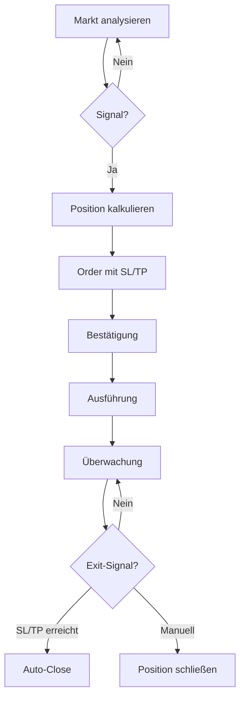

# Erster Trade

Dieser Guide führt dich durch deinen ersten Trade mit K.I.T. — vom Market-Check bis zur Order-Ausführung.

<Warning>
**Starte im Paper-Trading!** Teste K.I.T. zuerst mit virtuellem Geld:
```bash
kit config set trading.paperTrading true
```
</Warning>

## Voraussetzungen

<Check>
- K.I.T. installiert (`kit --version`)
- Exchange verbunden (`kit exchanges status`)
- Channel konfiguriert (optional, für Telegram-Befehle)
</Check>

## 1. Markt-Übersicht

<Steps>
  <Step title="Portfolio-Status prüfen">
    ```bash
    kit portfolio
    ```
    
    Oder via Telegram:
    ```
    📊 "Zeig mein Portfolio"
    ```
    
    Output:
    ```
    💰 Portfolio Übersicht
    ─────────────────────────
    Total: $10,245.32 (+2.3% heute)
    
    Assets:
    • USDT: $5,000.00 (48.8%)
    • BTC:  $3,245.32 (31.7%)
    • ETH:  $2,000.00 (19.5%)
    
    Offene Positionen: 0
    ```
  </Step>
  
  <Step title="Markt analysieren">
    ```bash
    kit analyze BTC/USDT
    ```
    
    Oder:
    ```
    📈 "Analysiere BTC"
    ```
    
    Output:
    ```
    📊 BTC/USDT Analyse
    ─────────────────────────
    Preis: $67,432.50 (+1.2%)
    24h Vol: $28.5B
    
    Technische Indikatoren:
    • RSI (14): 58 (Neutral)
    • MACD: Bullish Crossover
    • MA50: $65,200 (Preis drüber ✅)
    • MA200: $52,400 (Preis drüber ✅)
    
    Support: $65,000 | Resistance: $70,000
    
    K.I.T. Einschätzung: 🟢 Bullish Bias
    Empfehlung: Long bei Pullback zu $66,000
    ```
  </Step>
</Steps>

## 2. Order platzieren

### Market Order

Sofortige Ausführung zum aktuellen Preis:

```bash
kit buy BTC/USDT 100 --type market
```

Via Telegram:
```
🛒 "Kaufe BTC für 100 USDT"
```

### Limit Order

Ausführung bei bestimmtem Preis:

```bash
kit buy BTC/USDT 100 --price 66000
```

Via Telegram:
```
📝 "Kaufe BTC für 100 USDT bei 66000"
```

### Mit Stop-Loss und Take-Profit

```bash
kit buy BTC/USDT 100 --price 66000 --stop-loss 64000 --take-profit 72000
```

Via Telegram:
```
🎯 "Kaufe BTC für 100$ bei 66k, SL 64k, TP 72k"
```

## 3. Trade-Bestätigung

Wenn `confirmTrades: true` aktiviert ist:

```
⚠️ Trade-Bestätigung
─────────────────────────
Aktion: KAUFEN
Paar: BTC/USDT
Betrag: 100 USDT
Typ: Limit Order
Preis: $66,000
Stop-Loss: $64,000 (-3.03%)
Take-Profit: $72,000 (+9.09%)
Risk/Reward: 1:3

Gebühren (geschätzt): ~$0.10

[✅ Bestätigen] [❌ Abbrechen]
```

## 4. Position überwachen

```bash
kit positions
```

Via Telegram:
```
📋 "Zeig offene Positionen"
```

Output:
```
📈 Offene Positionen (1)
─────────────────────────
BTC/USDT Long
• Entry: $66,000
• Aktuell: $67,200 (+1.82%)
• Größe: 0.00151 BTC ($100)
• PnL: +$1.82
• SL: $64,000 | TP: $72,000

⏱️ Geöffnet: vor 2 Stunden
```

## 5. Position schließen

### Manuell

```bash
kit sell BTC/USDT --all
```

Via Telegram:
```
💰 "Verkaufe alle BTC"
```

### Teilverkauf

```bash
kit sell BTC/USDT 50%
```

Via Telegram:
```
💰 "Verkaufe 50% meiner BTC"
```

## Trade-Workflow Übersicht



## Beispiel-Session

Hier eine komplette Trading-Session via Telegram:

```
Du: "Wie sieht ETH aus?"

K.I.T.: 📊 ETH/USDT Analyse
Preis: $3,456.78 (-0.5%)
RSI: 35 (Überverkauft)
MACD: Bearish, aber abflachend
Support bei $3,400

🟡 Neutral - Möglicher Bounce bei Support

Du: "Setze Alert bei 3400"

K.I.T.: ✅ Alert gesetzt: ETH/USDT bei $3,400

--- 2 Stunden später ---

K.I.T.: 🔔 ALERT: ETH/USDT hat $3,400 erreicht!
Aktueller RSI: 28 (Stark überverkauft)
Volumen steigt.

Du: "Kaufe ETH für 200$ mit 3% SL"

K.I.T.: ⚠️ Trade-Bestätigung:
KAUFEN ETH/USDT
$200 @ Market
SL: $3,298 (-3%)
[✅ Bestätigen]

Du: ✅

K.I.T.: ✅ Order ausgeführt!
Gekauft: 0.058 ETH @ $3,412
SL aktiv bei $3,298

--- Nächster Tag ---

K.I.T.: 📈 Position Update
ETH/USDT: +5.2% ($3,590)
PnL: +$10.40 🟢

Möchtest du:
• Trailing Stop aktivieren?
• Take-Profit setzen?
• Position vergrößern?
```

## Häufige Befehle

| Aktion | CLI | Telegram |
|--------|-----|----------|
| Kaufen | `kit buy BTC 100` | "Kaufe BTC für 100$" |
| Verkaufen | `kit sell BTC --all` | "Verkaufe alle BTC" |
| Analyse | `kit analyze ETH` | "Analysiere ETH" |
| Portfolio | `kit portfolio` | "Zeig Portfolio" |
| Positionen | `kit positions` | "Offene Positionen" |
| Alert | `kit alert BTC 70000` | "Alert bei BTC 70k" |

## Best Practices

<Tip>
**Für Anfänger:**
1. Starte mit Paper-Trading
2. Kleine Positionsgrößen (max 5% pro Trade)
3. Immer Stop-Loss setzen
4. Nicht mehr als 3 offene Positionen
5. Führe ein Trading-Journal
</Tip>

## Nächste Schritte

<Columns>
  <Card title="Risiko-Management" href="/concepts/risk-management" icon="shield">
    Position-Sizing und Stop-Loss Strategien.
  </Card>
  <Card title="Auto-Trader" href="/skills/auto-trader" icon="bot">
    Automatische Trading-Strategien einrichten.
  </Card>
  <Card title="Alert-System" href="/skills/alert-system" icon="bell">
    Intelligente Alerts konfigurieren.
  </Card>
</Columns>
