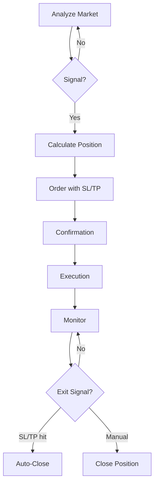

# First Trade

This guide walks you through your first trade with K.I.T. — from market check to order execution.

<Warning>
**Start with paper trading!** Test K.I.T. with virtual money first:
```bash
kit config set trading.paperTrading true
```
</Warning>

## Prerequisites

<Check>
- K.I.T. installed (`kit --version`)
- Exchange connected (`kit exchanges status`)
- Channel configured (optional, for Telegram commands)
</Check>

## 1. Market Overview

<Steps>
  <Step title="Check portfolio status">
    ```bash
    kit portfolio
    ```
    
    Or via Telegram:
    ```
    📊 "Show my portfolio"
    ```
    
    Output:
    ```
    💰 Portfolio Overview
    ─────────────────────────
    Total: $10,245.32 (+2.3% today)
    
    Assets:
    • USDT: $5,000.00 (48.8%)
    • BTC:  $3,245.32 (31.7%)
    • ETH:  $2,000.00 (19.5%)
    
    Open Positions: 0
    ```
  </Step>
  
  <Step title="Analyze market">
    ```bash
    kit analyze BTC/USDT
    ```
    
    Or:
    ```
    📈 "Analyze BTC"
    ```
    
    Output:
    ```
    📊 BTC/USDT Analysis
    ─────────────────────────
    Price: $67,432.50 (+1.2%)
    24h Vol: $28.5B
    
    Technical Indicators:
    • RSI (14): 58 (Neutral)
    • MACD: Bullish Crossover
    • MA50: $65,200 (Price above ✅)
    • MA200: $52,400 (Price above ✅)
    
    Support: $65,000 | Resistance: $70,000
    
    K.I.T. Assessment: 🟢 Bullish Bias
    Recommendation: Long on pullback to $66,000
    ```
  </Step>
</Steps>

## 2. Place Order

### Market Order

Immediate execution at current price:

```bash
kit buy BTC/USDT 100 --type market
```

Via Telegram:
```
🛒 "Buy BTC for 100 USDT"
```

### Limit Order

Execution at specified price:

```bash
kit buy BTC/USDT 100 --price 66000
```

Via Telegram:
```
📝 "Buy BTC for 100 USDT at 66000"
```

### With Stop-Loss and Take-Profit

```bash
kit buy BTC/USDT 100 --price 66000 --stop-loss 64000 --take-profit 72000
```

Via Telegram:
```
🎯 "Buy BTC for $100 at 66k, SL 64k, TP 72k"
```

## 3. Trade Confirmation

When `confirmTrades: true` is enabled:

```
⚠️ Trade Confirmation
─────────────────────────
Action: BUY
Pair: BTC/USDT
Amount: 100 USDT
Type: Limit Order
Price: $66,000
Stop-Loss: $64,000 (-3.03%)
Take-Profit: $72,000 (+9.09%)
Risk/Reward: 1:3

Fees (estimated): ~$0.10

[✅ Confirm] [❌ Cancel]
```

## 4. Monitor Position

```bash
kit positions
```

Via Telegram:
```
📋 "Show open positions"
```

Output:
```
📈 Open Positions (1)
─────────────────────────
BTC/USDT Long
• Entry: $66,000
• Current: $67,200 (+1.82%)
• Size: 0.00151 BTC ($100)
• PnL: +$1.82
• SL: $64,000 | TP: $72,000

⏱️ Opened: 2 hours ago
```

## 5. Close Position

### Manual

```bash
kit sell BTC/USDT --all
```

Via Telegram:
```
💰 "Sell all BTC"
```

### Partial Sale

```bash
kit sell BTC/USDT 50%
```

Via Telegram:
```
💰 "Sell 50% of my BTC"
```

## Trade Workflow Overview



## Example Session

Here's a complete trading session via Telegram:

```
You: "How does ETH look?"

K.I.T.: 📊 ETH/USDT Analysis
Price: $3,456.78 (-0.5%)
RSI: 35 (Oversold)
MACD: Bearish, but flattening
Support at $3,400

🟡 Neutral - Possible bounce at support

You: "Set alert at 3400"

K.I.T.: ✅ Alert set: ETH/USDT at $3,400

--- 2 hours later ---

K.I.T.: 🔔 ALERT: ETH/USDT reached $3,400!
Current RSI: 28 (Strongly oversold)
Volume rising.

You: "Buy ETH for $200 with 3% SL"

K.I.T.: ⚠️ Trade Confirmation:
BUY ETH/USDT
$200 @ Market
SL: $3,298 (-3%)
[✅ Confirm]

You: ✅

K.I.T.: ✅ Order executed!
Bought: 0.058 ETH @ $3,412
SL active at $3,298

--- Next day ---

K.I.T.: 📈 Position Update
ETH/USDT: +5.2% ($3,590)
PnL: +$10.40 🟢

Would you like to:
• Activate trailing stop?
• Set take-profit?
• Add to position?
```

## Common Commands

| Action | CLI | Telegram |
|--------|-----|----------|
| Buy | `kit buy BTC 100` | "Buy BTC for $100" |
| Sell | `kit sell BTC --all` | "Sell all BTC" |
| Analysis | `kit analyze ETH` | "Analyze ETH" |
| Portfolio | `kit portfolio` | "Show portfolio" |
| Positions | `kit positions` | "Open positions" |
| Alert | `kit alert BTC 70000` | "Alert at BTC 70k" |

## Best Practices

<Tip>
**For Beginners:**
1. Start with paper trading
2. Small position sizes (max 5% per trade)
3. Always set stop-loss
4. No more than 3 open positions
5. Keep a trading journal
</Tip>

## Next Steps

<Columns>
  <Card title="Risk Management" href="/concepts/risk-management" icon="shield">
    Position sizing and stop-loss strategies.
  </Card>
  <Card title="Auto-Trader" href="/skills/auto-trader" icon="bot">
    Set up automatic trading strategies.
  </Card>
  <Card title="Alert System" href="/skills/alert-system" icon="bell">
    Configure intelligent alerts.
  </Card>
</Columns>
